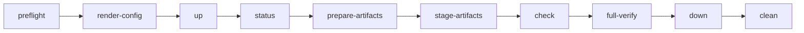

# Loopforge

Loopforge is an experiment environment package for building and verifying a
Gerrit/Jenkins integration stack. It models Gerrit, a Jenkins controller, a
Jenkins SSH build agent, LDAP-backed identity, Gerrit Trigger integration,
`Verified` voting, and reviewable validation evidence.

The first user-facing surface is the Docker simulation. It gives operators a
repeatable way to exercise the setup flow before moving into VM simulation or
target-deployment documentation.

## What You Can Do

- Run the Docker simulation from one CLI entrypoint.
- Prepare and stage reviewed Gerrit, Jenkins controller, and Jenkins agent
  artifacts before service mutation.
- Validate role readiness, cross-role integration, agent scheduling, and
  Gerrit `Verified` voting.
- Review generated evidence, checksums, bounded log references, and redaction
  summaries.
- Use the role manuals as the source of truth for target-oriented setup steps.

## Architecture At A Glance

```text
+---------------------------------------------------------------+
| Operator workstation / control node                           |
| Runs harness/helpers and coordinates setup and validation     |
+---------------------------------------------------------------+
      |                        |                        |
      v                        v                        v
+-----------+       +--------------------+       +--------------+
| Gerrit    |<----->| Jenkins controller |<----->| Jenkins agent|
+-----------+       +--------------------+       +--------------+
      ^                        ^                        ^
      |                        |                        |
      +------------------------+------------------------+
                               |
                    +----------------------+
                    | Bundle factory       |
                    | Prepares artifacts   |
                    +----------------------+

+---------------------------------------------------------------+
| LDAP                                                          |
| Shared identity service                                       |
+---------------------------------------------------------------+
```

Docker, VM, and target-deployment modes realize the same logical environments
with different infrastructure boundaries. Detailed interfaces and lifecycle
ownership are documented in `docs/system-model.md`.

## Docker Simulation Flow



## Start With Docker Simulation

The Docker simulation CLI is the first executable entrypoint:

```bash
simulation/docker/simulate.sh preflight
simulation/docker/simulate.sh render-config
simulation/docker/simulate.sh up
simulation/docker/simulate.sh status
simulation/docker/simulate.sh prepare-artifacts
simulation/docker/simulate.sh stage-artifacts
simulation/docker/simulate.sh check
simulation/docker/simulate.sh full-verify
simulation/docker/simulate.sh down
simulation/docker/simulate.sh clean
```

Use `clean` when generated runtime state should be removed.

To use a copied harness env file instead of the default example, pass
`--env FILE` to each command. See `simulation/docker/README.md` for command
details, inputs, outputs, generated paths, and simulation accounts.

## Repository Map

```text
.
├── AGENTS.md             # AI coding-agent instructions for this repository
├── docs/                 # Product scope, system model, topic references, and manuals
├── examples/             # Reviewed env-file examples with placeholder values
├── scripts/              # Role helpers, integration setup, and evidence collection
├── simulation/           # Shared simulation model and mode-specific harnesses
│   ├── docker/           # Docker simulation CLI, Compose file, and operator docs
│   └── vm/               # Planned VM simulation model and command contract
├── templates/            # Gerrit, Jenkins, agent, job, and integration templates
├── tests/                # Repository validation and contract tests
├── generated/            # Generated simulation/runtime output; not committed
└── logs/                 # Bounded local command logs; not committed
```

## Documentation Guide

Scope and model:

- `docs/prd.md` defines product goals, non-goals, requirements, and acceptance
  criteria.
- `docs/system-model.md` defines environments, actors, accounts, utilities,
  interfaces, lifecycle checkpoints, modes, and evidence relationships.

Topic references:

- `docs/account-model.md` defines runtime, admin, integration, test, bind, and
  simulation accounts.
- `docs/directory-model.md` defines product homes, helper-owned state,
  artifact extraction paths, runtime scratch, and simulation backing.
- `docs/package-requirements.md` defines layered Ubuntu package requirements
  for product runtimes, helper scripts, bundle factory, and Docker simulation.
- `docs/artifact-bundle-contract.md` defines application artifact archive
  contents, checksums, source boundaries, and bundle-factory dependencies.
- `docs/gerrit-trigger-integration.md` defines Gerrit Trigger, ACL, and
  `Verified` voting behavior.
- `docs/validation-and-evidence.md` defines validation evidence and redaction
  rules.

Simulation:

- `simulation/README.md` defines the shared simulation topology, version
  baseline, output conventions, and checkpoint contract.
- `simulation/docker/README.md` documents the Docker simulation CLI command
  surface.

Operator manuals:

- `docs/gerrit-setup-manual.md`,
  `docs/jenkins-controller-setup-manual.md`, and
  `docs/jenkins-agent-setup-manual.md` document role-local setup.
- `docs/integration-setup-manual.md` documents the shared cross-role
  integration workflow.
