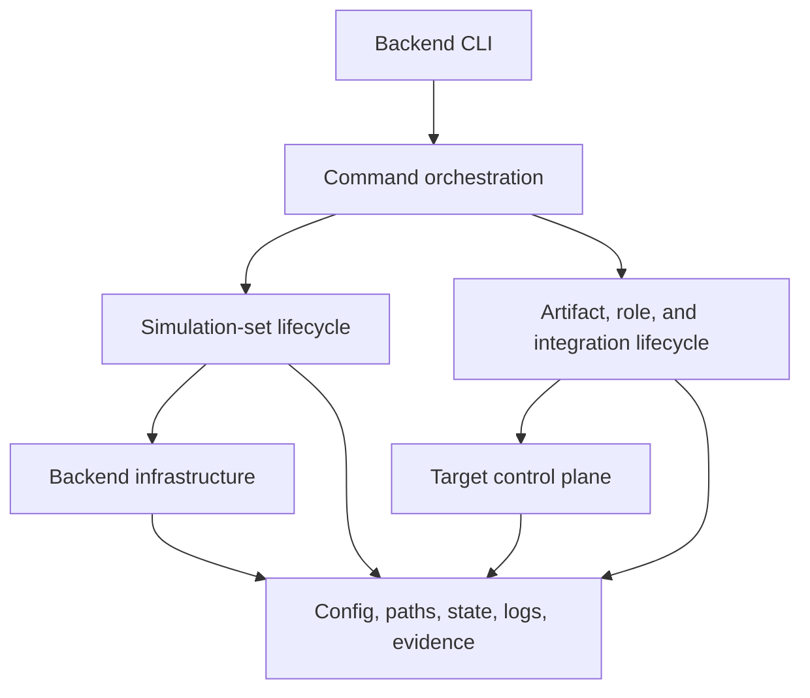
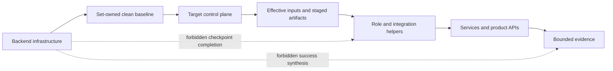

# Shared Simulation Harness Design

This document owns the backend-neutral internal architecture for Docker and VM
simulation. It is subordinate to `docs/contracts/lifecycle-contract.md` for
product lifecycle semantics and to `simulation/README.md` for the public shared
simulation command contract. Backend README files own concrete command
realization; backend implementation design files own Docker- or VM-specific
modules and mechanisms.

The exact simulation state dimensions, command guards, and transitions are
defined in `simulation/docs/lifecycle-state-model.md`.

## Design Goals

- Keep separate Docker and VM public CLIs.
- Give both backends the same simulation-set, run, checkpoint, and evidence
  meanings.
- Keep backend resource management below Loopforge lifecycle orchestration.
- Require target-like interfaces for post-baseline role and integration work.
- Share proven mechanics without imposing one backend dispatcher or a broad
  backend object API.
- Fail closed on missing, stale, conflicting, or unbound state.

## Architectural Planes

Both harnesses have three conceptual planes.

| Plane | Shared responsibility | Docker realization | VM realization |
| --- | --- | --- | --- |
| Backend infrastructure | Create, start, stop, restore, inspect, and destroy the selected simulation set | Compose images, containers, network, writable layers, bind data, and baseline archives | Libvirt domains, network, volumes, seed media, baked image, and baseline snapshots |
| Target control plane | Reach target environments through effective simulation identities and bounded operations | Target OS SSH into containers, plus explicitly labeled Docker transfer and collection waivers | Target OS SSH into guests, SSH transfer, and delegated privilege for narrow guest OS work |
| Loopforge lifecycle | Prepare and stage artifacts, configure and validate roles, configure and validate integration, prove the workflow, and collect evidence | Role helpers, integration helper, product APIs, and Docker evidence collection | The same helpers and APIs reached through VM target interfaces |

Backend infrastructure may prepare or restore the simulation set in which
checkpoints run. It must not manufacture role or integration checkpoint
success. The target control plane transports published effective inputs and
invokes the owning helper or product API; it does not own application
configuration.

## Dependency Direction

Command orchestration may call both backend infrastructure and lifecycle
capabilities. Lifecycle capabilities may call the target control plane and
shared foundation helpers. Lower planes must not call command orchestration or
claim higher-plane completion.

Forbidden directions include:

- backend infrastructure to role or integration helpers;
- target transport to command orchestration;
- marker or evidence helpers to lifecycle commands;
- validation to setup or repair operations;
- backend-specific modules to the other backend;
- shared helpers to Docker Compose or libvirt/KVM APIs.

## Shared Contract And Backend Ownership

| Concern | Shared contract | Backend-local realization |
| --- | --- | --- |
| Identity | Canonical `HARNESS_SET_ID`, immutable `HARNESS_RUN_ID`, active-run binding, and namespace derivation rules | Compose project `loopforge-docker-<set-id>` or libvirt prefix `loopforge-vm-<set-id>` plus ownership-checked short names |
| Generated paths | Set root, run root, retained review output, and mutable cleanup classes | Concrete Docker or VM subdirectories and ownership mechanisms |
| Lifecycle | Command names, state meanings, guards, preservation rules, and failure behavior | Compose/container operations or libvirt/domain operations |
| Persistence | Stable set lock, strict active-run and workflow records, atomic publication, and fail-closed parsing | Backend-local path realization and resource ownership probes |
| Inputs | Source-template custody, first-start effective publication, immutable helper inputs, and ephemeral access separation | Stable endpoint rendering plus Docker published ports or VM DHCP/SSH readiness |
| Checkpoints | Ordering, transaction state, hash-linked completion, binding, and observational validation | Backend command orchestration and target inventory |
| Evidence | Required identities, statuses, redaction, and bounded references | Backend resource metadata and collector mechanics |
| Terminal output | Compact command summaries and shared set/run fields | Compose project, libvirt prefix, URLs, SSH rows, and other backend fields |

The shared contract does not require identical module names, function names,
resource APIs, or transport implementations.

## Post-Baseline Boundary

After the clean baseline is captured, Loopforge role and integration
checkpoints must pass through target-like interfaces and helper-visible paths.
Backend infrastructure remains valid for simulation-set lifecycle commands but
must not complete application checkpoints.

Docker-only transfer, collection, and direct-process waivers must remain
explicitly labeled and evidenced. VM infrastructure operations such as seed
media, cloud-init bootstrap, snapshot restore, and guest power control remain
below the baseline or simulation-set lifecycle boundary.

## Shared Helper Boundary

Backend-neutral support may live under `simulation/lib/` when both harnesses
need the same semantics:

- role parsing and iteration;
- env loading and required-value checks;
- set/run identity validation and marker encoding;
- stable set locking and strict fixed-key state-record parsing;
- active-run pointer, workflow-head, and checkpoint-chain verification;
- atomic same-directory state publication;
- source/effective input custody and strict binding;
- bounded log setup and compact summaries;
- evidence record and redaction helpers;
- manifest and checksum helpers;
- shell quoting and repo-relative path resolution.

The following remain backend-local:

- Compose selection, container identity, bind mounts, ports, and Docker
  transfer waivers;
- libvirt domains, networks, pools, volumes, snapshots, seed media, and guest
  boot readiness;
- backend resource namespace derivation and live ownership queries;
- per-start transport discovery and SSH identity verification;
- baseline capture and restoration mechanics;
- backend destruction and host-wide recovery tools.

Repeated shape alone does not justify a shared backend code abstraction.
Promote code only when both implementations expose the same inputs, outputs,
failure semantics, and ownership boundary without backend conditionals.

## Review Rules

Reviewers of either harness should confirm that:

- public behavior matches the shared lifecycle state model and backend README;
- every mutating command validates selected set and run ownership first;
- set mutation is serialized by the stable set lock;
- `active-run.env` owns set claim/reset gating while `workflow-state.env` owns
  only the selected run's checkpoint progression;
- interrupted target mutation remains `active-incomplete` and never appears
  exact-bound;
- backend lifecycle operations do not complete Loopforge checkpoints;
- the first successful `start` publishes stable effective inputs before
  workflow readiness and repeated `start` never rewrites them;
- live transport refresh remains outside source/effective fingerprints;
- role and integration work uses the owning helpers and target-like interfaces;
- `start` performs no setup or repair;
- validation is observational;
- cleanup, restoration, destruction, and audit remain explicit commands;
- retained evidence cannot satisfy another run;
- logs, evidence, terminal summaries, and generated records remain bounded and
  redacted.
