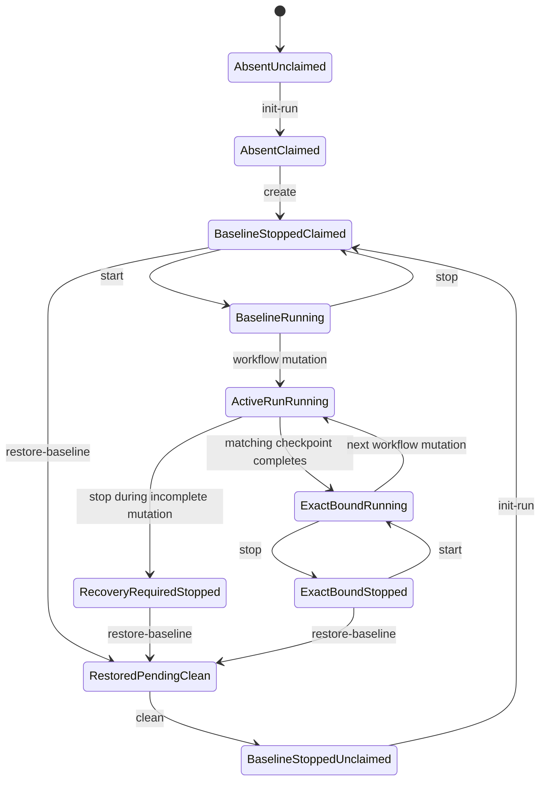

# Simulation Lifecycle State Model

This document owns the exact simulation-level state dimensions, command guards,
and transitions shared by Docker and VM simulation. It realizes, but does not
override, `docs/contracts/lifecycle-contract.md`. Public command descriptions
remain in `simulation/README.md` and the backend README files.

The model separates reusable simulation-set state from immutable run state.
It also separates backend resource power, durable content, active-run
ownership, reset gating, and workflow checkpoint progression. A command is
valid only when all relevant dimensions satisfy its guard.

## State Dimensions

| Dimension | States | Meaning |
| --- | --- | --- |
| Resource presence | `absent`, `present` | Whether the selected backend resources and baseline exist |
| Power | `not-applicable`, `stopped`, `running` | Runtime power state; absent resources use `not-applicable` |
| Durable content | `none`, `baseline`, `exact-bound`, `active-incomplete`, `conflicting` | Classification of container/VM durable state against the selected baseline and run |
| Run ownership | `unclaimed`, `claimed(<run-id>)` | Whether `active-run.env` binds the set to one immutable run |
| Reset gate | `normal`, `restored-pending-clean` | Whether successful restoration requires cleanup before further execution |
| Checkpoint progression | `none` or the last valid run checkpoint | Run-scoped workflow progress bound to the active run and reviewed inputs |

`exact-bound` means all durable state currently present is complete and bound
to the last successful checkpoint; later phases may still be absent.
`active-incomplete` means a mutating checkpoint is in progress, interrupted,
or only partially applied. Normal workflow commands may continue only when
their exact checkpoint prerequisites hold. A stopped `active-incomplete` set
cannot be restarted because `start` supports only baseline or exact-bound
durable state. `conflicting` state always blocks normal mutation.

## Core Invariants

- `HARNESS_SET_ID` identifies one reusable simulation set and defaults to
  `default` when omitted.
- `HARNESS_RUN_ID` identifies exactly one immutable attempt and is never
  reused.
- A set has at most one active run.
- The active-run pointer, run marker, runtime config, reviewed-input
  fingerprints, backend ownership, baseline identity, and checkpoints must
  agree.
- `stop` preserves every state dimension except power.
- `restore-baseline` changes durable content to `baseline` but deliberately
  preserves active-run ownership and generated run state.
- Successful restoration sets `restored-pending-clean`.
- Only `clean` or set destruction removes active-run ownership.
- Retained artifacts, evidence, and bounded logs remain under the old run root
  and cannot satisfy another run.
- Backend resource namespaces are derived from the backend and set ID and never
  from the run ID.

## Canonical State Combinations

| Name | Resources | Power | Durable content | Ownership | Reset gate |
| --- | --- | --- | --- | --- | --- |
| Absent and unclaimed | absent | not-applicable | none | unclaimed | normal |
| Absent but claimed | absent | not-applicable | none | claimed | normal |
| Baseline stopped and unclaimed | present | stopped | baseline | unclaimed | normal |
| Baseline stopped and claimed | present | stopped | baseline | claimed | normal |
| Baseline running | present | running | baseline | claimed | normal |
| Active run running | present | running | active-incomplete or exact-bound | claimed | normal |
| Exact-bound stopped | present | stopped | exact-bound | claimed | normal |
| Recovery-required stopped | present | stopped | active-incomplete or conflicting | claimed | normal |
| Restored pending clean | present | stopped | baseline | claimed | restored-pending-clean |

The same durable baseline appears in three combinations with different command
rights. A newly created or newly claimed baseline may start. A restored
baseline may not start until `clean` releases the old run and `init-run` claims
the set for a new run.

## Command Guard And Effect Matrix

| Command | Required state | Effect | Preserves |
| --- | --- | --- | --- |
| `preflight` | None; read-only host prerequisites | Reports prerequisite state | All simulation state |
| `init-run` | Set unclaimed, reset gate `normal`, unused run ID; resources absent or stopped at baseline | Creates private runtime inputs and run marker, then claims `active-run.env` | Existing baseline and backend resources |
| `create` | Claimed run, resources absent, matching reviewed inputs | Creates reusable resources and clean baseline, leaves power stopped | Run ownership and run inputs |
| `start` | Claimed run, reset gate `normal`, resources stopped, durable content `baseline` or `exact-bound` | Starts baseline prerequisites or services represented by exact bound checkpoints without setup mutation | Run ID, checkpoints, durable content, resource identity |
| `stop` | Claimed run and resources running | Gracefully stops services and backend runtime | Run ID, checkpoints, durable content, resources, evidence |
| `restore-baseline` | Claimed run, resources stopped, ownership-valid matching baseline, reset gate `normal` | Resets durable content to baseline and sets `restored-pending-clean` | Active run, mutable run state, retained review output, reusable resources |
| `clean` | `restored-pending-clean`, matching successful restore evidence, claimed run, resources stopped | Removes mutable run state and active-run pointer; returns to baseline stopped and unclaimed | Baseline, reusable resources, retained artifacts, evidence, and logs |
| `destroy` | Resources absent or stopped and selected ownership validated | Removes set resources, baseline, set metadata, and active pointer | Retained run roots and review output |
| `status` | Selected state resolvable; read-only | Reports set, run, power, and access state | All simulation state |
| `audit-state` | None beyond selected identity inputs; read-only | Reports generated/backend consistency | All simulation state |
| Workflow phases | Claimed run, resources running, reset gate `normal`, exact preceding checkpoint and state classification | Advances only the owning checkpoint and may mutate its declared state | Set/run binding and prior evidence |

`init-run` must publish the run marker and active-run pointer atomically from
the operator's perspective. A failed initialization must not leave a pointer
that appears valid without its complete matching run state.

## Normal Lifecycle Transitions



`destroy` may transition any ownership-valid non-running set state to absent
and unclaimed, including an absent-but-claimed set after failed creation. It is
omitted from the diagram to keep the normal reuse path readable. Retained run
roots remain after destruction.

## Restored-Pending-Clean Gate

Successful `restore-baseline` is a one-way boundary for the active run. Its
configured durable state has been erased, while its mutable checkpoints and
active-run pointer remain for validation, diagnosis, and cleanup authorization.
The run cannot resume and the set cannot be claimed by another run.

While the reset gate is `restored-pending-clean`:

| Allowed | Blocked |
| --- | --- |
| `preflight`, `status`, `audit-state`, `clean`, `destroy` | `init-run`, `create`, `start`, `ssh`, artifact phases, role phases, integration phases, `reboot`, and another `restore-baseline` |

This gate prevents old checkpoints from being combined with baseline durable
state. `clean` is the normal exit. `destroy` is the destructive exit when the
reusable set should not be retained.

If restoration fails, the gate is not recorded as successful and `clean` must
not release the set. The failed run remains active. Operators inspect with
`audit-state` and retained bounded logs, then use only an ownership-valid
explicit recovery action; normal workflow commands remain blocked.

## Full Reuse Sequence

```text
run A exact-bound and running
  -> stop
     exact-bound, stopped, claimed by run A
  -> restore-baseline
     baseline, stopped, claimed by run A, restored-pending-clean
  -> clean
     baseline, stopped, unclaimed; run A review output retained
  -> init-run
     baseline, stopped, claimed by new run B
  -> start
     baseline prerequisites running for run B
```

`create` is absent from the reuse sequence because the set resources and clean
baseline survive `clean`. After `destroy`, a new sequence requires
`init-run -> create -> start`.

## Failure Behavior

- Missing or mismatched markers, ownership, baseline identity, or fingerprints
  block before mutation.
- No command repairs stale state, reads legacy markers, or infers ownership from
  partial resources.
- Read-only inspection does not clear gates or manufacture readiness.
- A failed `start` leaves the same run active and does not create a new run ID.
- A stopped incomplete or conflicting run uses explicit restoration and cleanup
  or destruction; it cannot use `start` to continue.
- Retained evidence from an old run never satisfies a new run's prerequisite.
