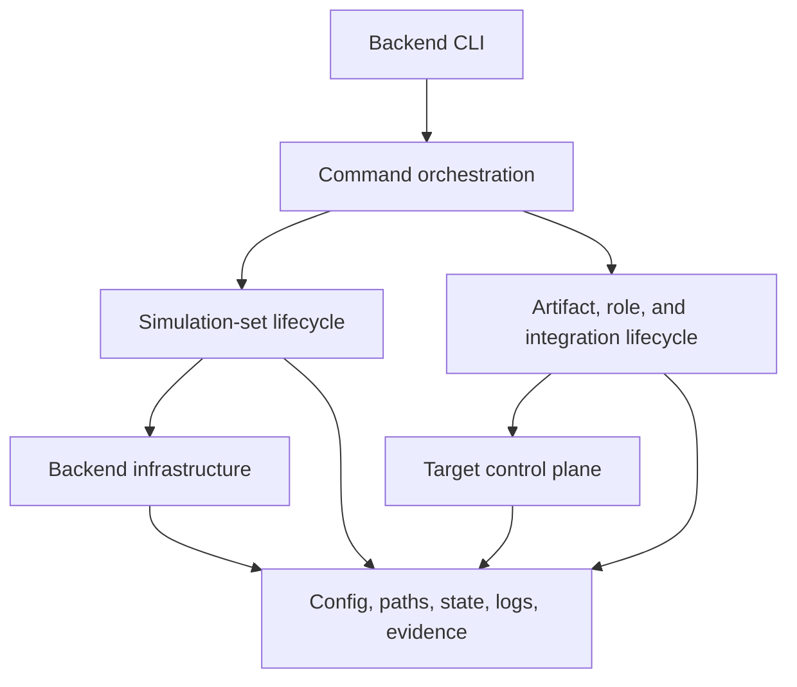
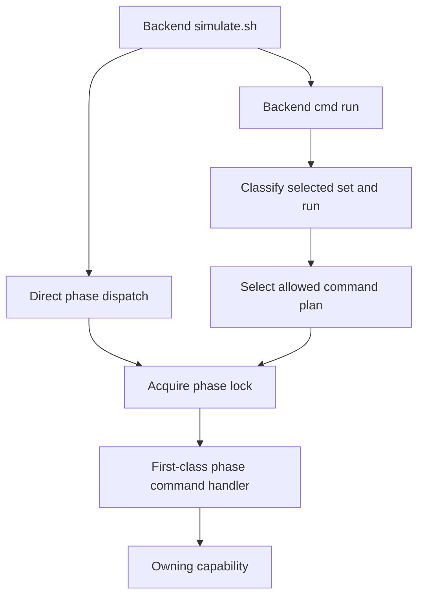
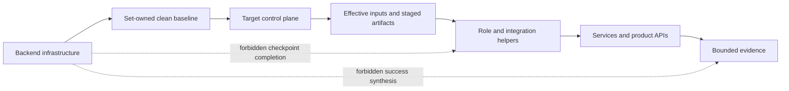

# Shared Simulation Harness Design

This document owns the backend-neutral internal architecture for Docker and VM
simulation. It is subordinate to `docs/contracts/lifecycle-contract.md` for
product lifecycle semantics and to `simulation/docs/shared/simulation-model.md` for
the public shared simulation command contract. Backend simulation guides own concrete command
realization; backend implementation design files own Docker- or VM-specific
modules and mechanisms.

The exact simulation state dimensions, command guards, and transitions are
defined in `simulation/docs/shared/lifecycle-state-model.md`. Acceptance and
publication of owning-layer results and evidence are defined in
`simulation/docs/shared/checkpoint-acceptance-protocol.md`.
Generated set, lock, and run storage is defined in
`simulation/docs/shared/generated-state-layout.md`.

## Design Goals

- Keep separate Docker and VM public CLIs.
- Give both backends the same simulation-set, run, checkpoint, and evidence
  meanings.
- Keep backend resource management below Loopforge lifecycle orchestration.
- Require target-like interfaces for post-baseline role and integration work.
- Share proven mechanics without imposing one backend dispatcher or a broad
  backend object API.
- Fail closed on missing, stale, conflicting, or unbound state.

## Architectural Planes

Both harnesses have three conceptual planes.

| Plane | Shared responsibility | Docker realization | VM realization |
| --- | --- | --- | --- |
| Backend infrastructure | Create, start, stop, restore, inspect, and destroy the selected simulation set | Compose images, containers, network, writable layers, bind data, and baseline archives | Libvirt domains, network, volumes, seed media, baked image, and baseline snapshots |
| Target control plane | Reach target environments through effective simulation identities and bounded operations | Target OS SSH into containers, plus explicitly labeled Docker transfer and collection waivers | Target OS SSH into guests, SSH transfer, and delegated privilege for narrow guest OS work |
| Loopforge lifecycle | Prepare and stage artifacts, configure and validate roles, configure and validate integration, prove the workflow, and collect evidence | Role helpers, integration helper, product APIs, and Docker evidence collection | The same helpers and APIs reached through VM target interfaces |

Backend infrastructure may prepare or restore the simulation set in which
checkpoints run. It must not manufacture role or integration checkpoint
success. The target control plane transports published effective inputs and
invokes the owning helper or product API; it does not own application
configuration.

## Common Harness Structure

Both harnesses implement the architectural planes with the same conceptual
module roles. Backend implementation designs map concrete files onto these
roles and document backend-only splits.

| Module role | Shared responsibility |
| --- | --- |
| Backend entrypoint | Parse the public CLI, load shared and backend-local modules, and dispatch command-shaped functions. It remains thin and contains no lifecycle implementation bodies. |
| Command orchestration | Own composite workflow sequencing, set-lock selection, command summaries, and delegation. It is the only command-shaped implementation layer. |
| Simulation-set capabilities | Coordinate create, start, stop, restore, status, audit, clean, and destroy against ownership-validated backend resources without completing product checkpoints. |
| Lifecycle capabilities | Prepare and stage artifacts, invoke role helpers, invoke the integration owner, and verify owning-layer results for orchestration acceptance. They do not redefine role or integration postconditions. |
| Target control plane | Provide current target access, bounded command execution, input and artifact transfer, and interactive operator SSH through backend-approved mechanisms. |
| Backend infrastructure | Implement Compose/container or libvirt/VM resource primitives without calling lifecycle capabilities or command orchestration. |
| Backend foundation | Realize canonical paths, backend configuration, shared-state adapters, and backend evidence metadata. State adapters do not query live backend resources. |
| Shared foundation | Provide backend-neutral identity, locking, state, input, role, artifact, permission, log, evidence-path, and quoting mechanics under `simulation/lib/`. |

The common roles do not require identical filenames or functions. They define
ownership and dependency direction. Matching backend filenames are useful only
when they describe the same role; they do not create a cross-backend API.

## Dependency Direction

Command orchestration may call both backend infrastructure and lifecycle
capabilities. Lifecycle capabilities may call the target control plane and
shared foundation helpers. Lower planes must not call command orchestration or
claim higher-plane completion.

Forbidden directions include:

- backend infrastructure to role or integration helpers;
- target transport to command orchestration;
- marker or evidence helpers to lifecycle commands;
- validation to setup or repair operations;
- backend-specific modules to the other backend;
- shared helpers to Docker Compose or libvirt/KVM APIs.

## Public Command Shape And Run Composition

Both `run` and the granular phase commands are first-class public commands.
The distinction is composite versus granular, not primary versus secondary.
A direct phase invocation and the same phase selected by `run` must converge on
the same command handler before capability delegation. `run` must not bypass a
command handler to call its lower-level simulation-set, artifact, role, or
integration capability directly.

The common command shape is:

| Public command scope | Conceptual command handler | Delegated responsibility |
| --- | --- | --- |
| Composite workflow | `<backend>_cmd_run` | Classify selected state, construct the allowed plan, and invoke command handlers from its first required step |
| Run initialization | `<backend>_cmd_preflight`, `<backend>_cmd_init_run` | Validate prerequisites and claim immutable run state |
| Simulation-set lifecycle | `<backend>_cmd_create`, `<backend>_cmd_start`, `<backend>_cmd_stop`, `<backend>_cmd_restore_baseline`, `<backend>_cmd_clean`, `<backend>_cmd_destroy` | Delegate to ownership-checked backend set and baseline capabilities |
| Observation and access | `<backend>_cmd_status`, `<backend>_cmd_audit_state`, `<backend>_cmd_ssh` | Delegate to read-only inspection or current target access capabilities |
| Artifact lifecycle | `<backend>_cmd_prepare_artifacts`, `<backend>_cmd_stage_artifacts` | Expand the selected roles and delegate to artifact capabilities |
| Role lifecycle | `<backend>_cmd_configure_role`, `<backend>_cmd_validate_role` | Expand the selected roles and delegate to role capabilities |
| Integration lifecycle | `<backend>_cmd_configure_integration`, `<backend>_cmd_validate_integration`, `<backend>_cmd_prove_integration` | Delegate to the shared integration invocation adapter |

The placeholder names describe a common implementation shape, not a sourced
cross-backend shell API. The two backend bindings are intentionally compact:

| Backend | Public entrypoint | Command-orchestration module | Handler prefix | Step and lock adapters | Backend-only command |
| --- | --- | --- | --- | --- | --- |
| Docker | `simulation/docker/simulate.sh` | `simulation/docker/lib/lifecycle.sh` | `docker_cmd_` | `__docker_cmd_workflow_step`, `docker_cmd_with_lock` | None |
| VM | `simulation/vm/simulate.sh` | `simulation/vm/lib/lifecycle.sh` | `vm_cmd_` | `vm_workflow_step`, `vm_command_with_lock` | `reboot` |

The backend entrypoint dispatches a direct phase through its normal lock
adapter to the command handler. It dispatches `run` to the backend-local run
handler, which uses shared state mechanics to select a plan and then reaches
each selected phase through that same lock adapter and command handler.

### Run Plan Selection

`simulation/docs/shared/lifecycle-state-model.md` owns the exact state guards
and transitions. Command orchestration applies them as follows:

| Selected state | Command plan |
| --- | --- |
| Fresh absent set | `preflight -> init-run -> create -> start -> status`, then workflow handlers from the first checkpoint |
| Unclaimed retained baseline | `init-run -> create -> start -> status`, then workflow handlers from the first checkpoint; `create` verifies the retained set without mutation |
| Exact resumable run, stopped | `start -> status`, then workflow handlers from the next required checkpoint |
| Exact resumable run, running | `status`, then workflow handlers from the next required checkpoint |
| Exact completed run, stopped | `start -> status`, then report `already-complete` without repeating a workflow checkpoint |
| Exact completed run, running | `status`, then report `already-complete` without repeating a workflow checkpoint |
| Unsupported or conflicting state | Fail before invoking a mutating phase |

`status` is an intentional user-facing observation in each executable plan. It
shows the selected set after `start`, or confirms an already-running set before
resume or completion output. It neither advances the workflow ledger nor owns
a workflow prerequisite.

`run` does not hold the set lock across the whole composite. Each selected
command uses the same shared or exclusive lock mode as its direct invocation,
so every successful command boundary is durable and independently resumable.
The run handler stops at the first nonzero command result and does not invoke a
later handler. Checkpoint families and role expansion follow the exact order in
the lifecycle state model and checkpoint acceptance protocol.

No run plan contains `stop`, `restore-baseline`, `clean`, `destroy`,
`audit-state`, or a backend-only command such as VM `reboot`. Recovery remains
an explicit operator action outside the composite.

## Shared Contract And Backend Ownership

| Concern | Shared contract | Backend-local realization |
| --- | --- | --- |
| Identity | Canonical `HARNESS_SET_ID`, immutable `HARNESS_RUN_ID`, active-run binding, and namespace derivation rules | Compose project `loopforge-docker-<set-id>` or libvirt prefix `loopforge-vm-<set-id>` plus ownership-checked short names |
| Generated paths | Set root, run root, retained review output, and mutable cleanup classes | Concrete Docker or VM subdirectories and ownership mechanisms |
| Lifecycle | Command names, state meanings, guards, preservation rules, and failure behavior | Compose/container operations or libvirt/domain operations |
| Persistence | Stable set lock, strict active-run and workflow records, atomic publication, and fail-closed parsing | Backend-local path realization and resource ownership probes |
| Inputs | Source-template custody, first-start effective publication, immutable helper inputs, and ephemeral access separation | Stable endpoint rendering plus Docker published ports or VM DHCP/SSH readiness |
| Checkpoint acceptance | Shared proof and publication protocol | Backend acceptance of owning-layer results under the selected set lock |
| Evidence | Required identities, statuses, redaction, and bounded references | Backend resource metadata and collector mechanics |
| Terminal output | Compact command summaries and shared set/run fields | Compose project, libvirt prefix, URLs, SSH rows, and other backend fields |

The shared contract does not require identical module names, function names,
resource APIs, or transport implementations.

## Post-Baseline Boundary

After the clean baseline is captured, Loopforge role and integration
checkpoints must pass through target-like interfaces and helper-visible paths.
Backend infrastructure remains valid for simulation-set lifecycle commands but
must not complete application checkpoints.

Docker-only transfer, collection, and direct-process waivers must remain
explicitly labeled and evidenced. VM infrastructure operations such as seed
media, cloud-init bootstrap, snapshot restore, and guest power control remain
below the baseline or simulation-set lifecycle boundary.

## Shared Helper Boundary

Both harnesses source the implemented foundation under `simulation/lib/`:

| Shared module | Responsibility |
| --- | --- |
| `common.sh`, `quote.sh` | Fail-closed command utilities, compact summaries, timestamps, readable-file checks, and shell/JSON quoting. |
| `roles.sh`, `artifacts.sh` | Shared role vocabulary and iteration plus artifact names, manifest parsing, baseline validation, and checksum verification. |
| `env.sh` | Env loading, base-relative path resolution, env record updates, and atomic simulation input-bundle custody. |
| `identity.sh`, `locking.sh` | Canonical set/run identity, resource namespace derivation, stable set locks, and lock-scoped execution. |
| `state.sh` | Strict records, active-run and workflow binding, input publication, baseline/reset binding, checkpoint chains, and selected-state classification. |
| `permissions.sh`, `logs.sh`, `evidence.sh` | Shared permission classes plus bounded-log and evidence-record path construction. |

Backend modules consume these mechanics rather than defining alternate shared
state, identity, input, or permission models. Shared modules must not inspect
Docker Compose or libvirt/KVM resources, discover live transport, or dispatch
backend commands.

The following remain backend-local:

- Compose selection, container identity, bind mounts, ports, and Docker
  transfer waivers;
- libvirt domains, networks, pools, volumes, snapshots, seed media, and guest
  boot readiness;
- backend resource namespace derivation and live ownership queries;
- per-start transport discovery and SSH identity verification;
- baseline capture and restoration mechanics;
- backend destruction and host-wide recovery tools.

Repeated shape alone does not justify a shared backend code abstraction.
Promote code only when both implementations expose the same inputs, outputs,
failure semantics, and ownership boundary without backend conditionals.

## Review Rules

Reviewers of either harness should confirm that:

- public behavior delegates state and workflow checkpoint publication to the
  shared state model and acceptance protocol;
- module dependencies follow the architectural planes and do not call upward;
- backend lifecycle operations do not complete Loopforge product checkpoints;
- role and integration work uses the owning helpers and target-like interfaces;
- backend-local mechanisms do not create a second shared state or input model;
- logs, evidence, terminal summaries, and generated records remain bounded and
  redacted.
