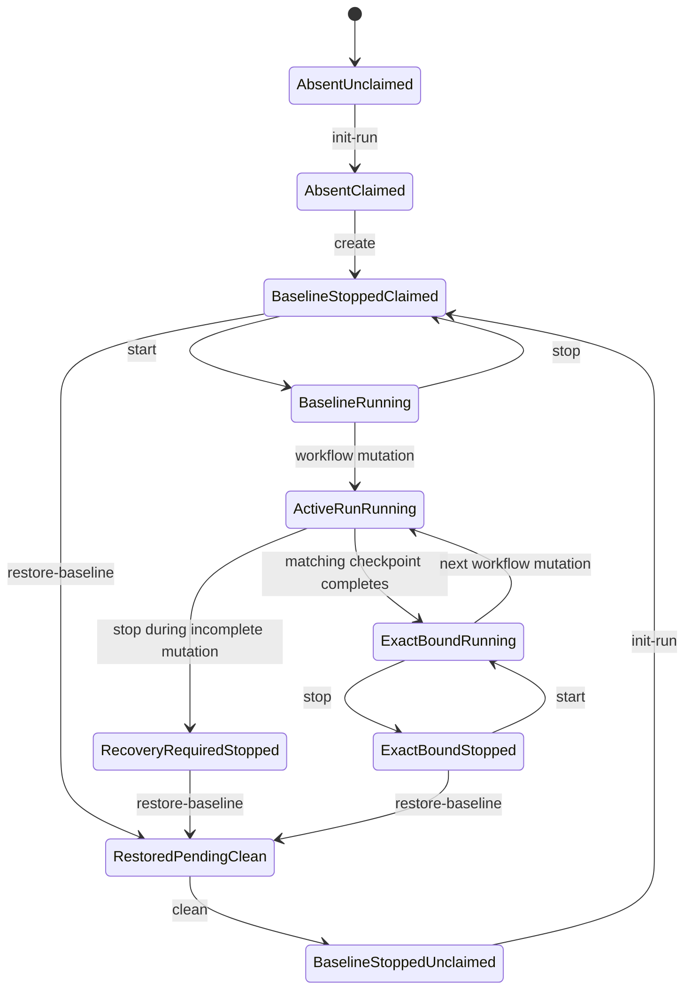

# Simulation Lifecycle State Model

This document owns the simulation ledger model shared by Docker and VM:
persisted state, checkpoint vocabulary and order, record mechanics, command
guards, classifications, and transition effects. It answers which ledger state
is valid and what state effect a lifecycle event has. It realizes, but does not
override, `docs/contracts/lifecycle-contract.md`. Public command descriptions
remain in `simulation/docs/shared/simulation-model.md` and the backend simulation
guides.

`simulation/docs/shared/generated-state-layout.md` owns the locations and
custody classes of the records described here. A path named in this document
locates a state record; it does not transfer directory-layout authority here.

`simulation/docs/shared/checkpoint-acceptance-protocol.md` separately owns the
cross-layer acceptance and publication protocol: which owning-layer outputs and
evidence the harness must verify, who verifies them, and when the harness may
invoke a transition defined here. The protocol does not add ledger states,
checkpoint names, classifications, or transition effects. This state model
does not define owning-layer postconditions, evidence acceptance, or transaction
steps.

The model separates reusable simulation-set state from immutable run state.
It also separates backend resource power, durable content, active-run
ownership, reset gating, and workflow checkpoint progression. A command is
valid only when all relevant dimensions satisfy its guard.

## Product-To-Simulation Checkpoint Mapping

The product checkpoint semantics and boundaries come from
`docs/contracts/lifecycle-contract.md`. Simulation source selection is bound by
`init-run`, and the first successful `start` publishes effective inputs. OS
dependency readiness is established or verified as part of the clean baseline
by `create`. These operations are workflow prerequisites, not workflow
checkpoints, and do not claim application setup success.

The following table is the complete simulation workflow checkpoint chain in
strict predecessor order. Within each role-qualified family, `<role>` expands
in order to `gerrit`, `jenkins-controller`, then `jenkins-agent`. A family is
fully expanded before the next family begins, and each expansion advances
independently.

| Product checkpoint | Workflow checkpoint |
| --- | --- |
| Artifact preparation | `prepare-artifacts-<role>` |
| Artifact staging | `stage-artifacts-<role>` |
| Role-local setup | `configure-role-<role>` |
| Role-local validation | `validate-role-<role>` |
| Integration preflight | `integration-preflight` |
| Shared integration setup | `configure-integration` |
| Cross-role validation | `validate-integration` |
| End-to-end trigger verification | `prove-integration` |
| Evidence audit | `evidence-audit` |

The concrete role expansions and five unqualified identifiers in the final
column are the only non-`none` values accepted by `active_checkpoint` and
`last_checkpoint`. Backend lifecycle commands never advance this chain.
Simulation has no Reviewed Access checkpoint, wait, or resume path.

## Identity And Namespace Derivation

`HARNESS_SET_ID` is canonical input, not a value that backends normalize. It
must match this grammar and defaults to `default` when omitted:

```text
^[a-z0-9]([a-z0-9-]{0,22}[a-z0-9])?$
```

The value is 1-24 lowercase ASCII letters, digits, or internal hyphens. An
invalid value fails before generated-state or backend mutation. The exact
accepted value names the set root and lock and derives the primary backend
namespace injectively:

```text
Docker Compose project: loopforge-docker-<set-id>
VM libvirt prefix:      loopforge-vm-<set-id>
```

These namespaces are backend metadata, not operator inputs. Short
backend identifiers with stricter limits, such as a Linux bridge name, use a
versioned SHA-256 derivation over the backend, exact set ID, and resource kind,
for example `lf-<12-hex>`. The backend must still verify full ownership
metadata; a short-name collision blocks and never adopts another set's
resource.

## State Dimensions

| Dimension | States | Meaning |
| --- | --- | --- |
| Resource presence | `absent`, `present` | Whether the selected backend resources and baseline exist |
| Power | `not-applicable`, `stopped`, `running` | Runtime power state; absent resources use `not-applicable` |
| Durable content | `none`, `baseline`, `exact-bound`, `active-incomplete`, `conflicting` | Classification of container/VM durable state against the selected baseline and run |
| Run ownership | `unclaimed`, `claimed(<run-id>)` | Whether `active-run.env` binds the set to one immutable run |
| Reset gate | `normal`, `restored-pending-clean` | Whether successful restoration requires cleanup before further execution |
| Input publication | `pending`, `ready` | Whether only source templates are bound or stable effective helper inputs have been atomically published |
| Checkpoint progression | `none` or the last valid run checkpoint | Run-scoped workflow progress bound to the active run and source/effective inputs |
| Checkpoint activity | `idle`, `observing`, `mutating` | Whether no phase is open, an observational phase is open, or target mutation is open |

`exact-bound` means all durable state currently present is complete and bound
to the last successful checkpoint; later phases may still be absent.
`active-incomplete` means a mutating checkpoint is in progress, interrupted,
or only partially applied. Normal workflow commands may continue only when
their exact checkpoint prerequisites hold. A stopped `active-incomplete` set
cannot be restarted because `start` supports only baseline or exact-bound
durable state. `conflicting` state always blocks normal mutation.

## Core Invariants

- `HARNESS_SET_ID` identifies one reusable simulation set and defaults to
  `default` when omitted.
- `HARNESS_RUN_ID` identifies exactly one immutable attempt and is never
  reused.
- A set has at most one active run.
- The active-run pointer, run marker, workflow state, runtime config, source and
  effective input fingerprints, backend ownership, baseline identity, and
  checkpoint record chain must agree.
- `stop` preserves every state dimension except power.
- `restore-baseline` changes durable content to `baseline` but deliberately
  preserves active-run ownership and generated run state.
- Successful restoration sets `restored-pending-clean`.
- Only `clean` or set destruction removes active-run ownership.
- Retained artifacts, evidence, and bounded logs remain bound to their original
  run root.
- Backend resource namespaces are derived from the backend and set ID and never
  from the run ID.

## Persistence And Concurrency

Each set has one stable lock outside its deletable set root:

```text
generated/simulation/<backend>/locks/<set-id>.lock
```

Mutating commands take a nonblocking exclusive lock. `status`, `audit-state`,
and other state-reading commands take a shared lock. Contention fails with
`set busy`; commands do not wait indefinitely or bypass the lock. The
composite `run` command acquires and releases the lock through each internal
command rather than holding one lock across the whole workflow.

The set-scoped `active-run.env` is the authoritative ownership and reset-gate
record. It has a strict fixed-key schema such as:

```text
schema_version=1
backend=docker
set_id=default
run_id=run-A
resource_namespace=loopforge-docker-default
run_marker_sha256=<sha256>
baseline_fingerprint=<sha256-or-none>
state=active
restore_evidence_sha256=none
```

After successful restoration, `state` is `restored-pending-clean` and
`restore_evidence_sha256` names the matching immutable evidence. Parsers must
not shell-source this file. Unknown, duplicate, missing, malformed, or
out-of-order fields fail closed.

The run-scoped `workflow-state.env` is authoritative only for progression of
the run selected by `active-run.env`. It has a strict fixed-key schema such as:

```text
schema_version=1
backend=docker
set_id=default
run_id=run-A
run_marker_sha256=<sha256>
baseline_fingerprint=<sha256-or-none>
source_inputs_fingerprint=<sha256>
input_state=pending
effective_inputs_fingerprint=none
activity=idle
active_checkpoint=none
last_checkpoint=none
last_record_sha256=none
```

The active-run pointer selects the only workflow state allowed to affect the
set. A retained workflow record without that matching pointer is historical
output and cannot claim or resume the set. The pointer does not copy the
mutable workflow-head hash; both records bind independently to the immutable
run marker and must agree on their shared identities and fingerprints.

The immutable run marker binds the private source snapshots and records
`source_inputs_fingerprint`. On the first successful `start`, the harness
renders stable helper inputs in a private sibling directory and atomically
publishes `host/runtime-inputs/` plus a strict
`host/state/effective-inputs.env` record such as:

```text
schema_version=1
backend=docker
set_id=default
run_id=run-A
run_marker_sha256=<sha256>
source_inputs_fingerprint=<sha256>
effective_inputs_fingerprint=<sha256>
```

The effective-input record is published before workflow state changes to
`input_state=ready` with the matching fingerprint. A repeated `start` verifies
the existing directory and record byte-for-byte and does not republish them.
Workflow phases require `input_state=ready`.

Workflow checkpoint records are immutable and hash-linked through
`last_record_sha256`. Each record identifies the backend, set, run, baseline,
source and effective inputs, checkpoint, predecessor, mutation kind,
`status=complete`, `evidence_sha256`, and timestamps. Unknown checkpoint names
or invalid predecessor ordering fail closed.

Only completed checkpoints produce workflow checkpoint records. Other outcomes
do not add a workflow record or advance the chain. The acceptance protocol owns
which evidence may supply `evidence_sha256`; the mapping above owns every
accepted checkpoint name and its strict predecessor order.

## Checkpoint State Transitions

The ledger exposes two checkpoint transitions. Their guards and effects are
state-model facts; proof ownership and invocation order belong to
`simulation/docs/shared/checkpoint-acceptance-protocol.md`.

| Transition | Guard | Successful ledger effect |
| --- | --- | --- |
| `open-checkpoint(<checkpoint>, <activity>)` | Effective inputs ready, activity `idle`, exact next checkpoint, and `<activity>` is `observing` or `mutating` | Set `active_checkpoint` and `<activity>` without changing the workflow head |
| `commit-checkpoint(<record>)` | Open activity matches the structurally valid, exact-predecessor record and its immutable run/input bindings | Append the hash-linked workflow record, advance `last_checkpoint` and `last_record_sha256`, then clear the active checkpoint and return to `idle` |

These are internal ledger transitions, not public commands. `open-checkpoint`
atomically replaces the workflow head. `commit-checkpoint` writes and verifies
the immutable record before atomically replacing that head. A failure before
head replacement leaves the prior open head authoritative; an unreferenced
record cannot advance progression.

An open `mutating` checkpoint classifies durable state as `active-incomplete`.
An open `observing` checkpoint leaves unchanged durable content exact-bound but
blocks other checkpoint progression. Failure before `open-checkpoint` leaves
the ledger unchanged. Failure after it leaves the activity open: mutation uses
explicit recovery, while observation may retry only the same checkpoint against
the unchanged head and inputs. No failure path calls `commit-checkpoint`.

## Run And Reset Transitions

Initialization writes the complete run root, immutable run marker, and initial
workflow state before atomically publishing `active-run.env` last. A crash
before pointer publication consumes the run ID but does not claim the set.
Initial workflow state has effective inputs pending. The first successful
`start` verifies target access, publishes the effective bundle and binding
record, then changes the workflow head to ready before reporting success. A
failure before ready publication leaves workflow phases blocked and never
appears as effective-input success.
Restoration writes and verifies immutable evidence before atomically changing
the pointer gate. Cleanup removes known mutable paths idempotently, preserves
the immutable run marker, checkpoint records, evidence, artifacts, and logs,
then removes the active-run pointer last.

Once the pointer records `restored-pending-clean`, `clean` authorization comes
from that strict pointer, its immutable run marker, and matching restoration
evidence. A retry may find any known mutable cleanup target, including
`workflow-state.env`, already absent. That absence is idempotent cleanup
progress, not a stale-state fallback. Missing or mismatched authorization
records still block. Read-only inspection may report `cleanup-in-progress`
until the pointer is removed.

## Exact-Bound Classification

The shared state layer owns classification; role and integration commands own
their checkpoint postconditions. The classifier reads all state under the set
lock and returns:

- `baseline` when no target-mutating checkpoint has completed, no mutation is
  open, and the selected clean baseline is exact;
- `exact-bound` when the pointer, marker, ownership, baseline, source and
  effective inputs, workflow head, and immutable checkpoint chain agree with no
  open mutation;
- `active-incomplete` when a target mutation was published but its completion
  record and idle head were not published; or
- `conflicting` when identities, fingerprints, ownership, hashes, checkpoint
  order, or backend state disagree.

`start` consumes this classification but does not rerun checkpoint validation
or infer setup success from service state. An interrupted observation may
leave durable content `exact-bound` while checkpoint progression is blocked.

## Canonical State Combinations

| Name | Resources | Power | Durable content | Ownership | Reset gate |
| --- | --- | --- | --- | --- | --- |
| Absent and unclaimed | absent | not-applicable | none | unclaimed | normal |
| Absent but claimed | absent | not-applicable | none | claimed | normal |
| Baseline stopped and unclaimed | present | stopped | baseline | unclaimed | normal |
| Baseline stopped and claimed | present | stopped | baseline | claimed | normal |
| Baseline running | present | running | baseline | claimed | normal |
| Active run running | present | running | active-incomplete or exact-bound | claimed | normal |
| Exact-bound stopped | present | stopped | exact-bound | claimed | normal |
| Recovery-required stopped | present | stopped | active-incomplete or conflicting | claimed | normal |
| Restored pending clean | present | stopped | baseline | claimed | restored-pending-clean |

The same durable baseline appears in three combinations with different command
rights. A newly created or newly claimed baseline may start. A restored
baseline may not start until `clean` releases the old run and `init-run` claims
the set for a new run.

## Command Guard And Effect Matrix

| Command | Required state | Effect | Preserves |
| --- | --- | --- | --- |
| `preflight` | None; read-only host prerequisites | Reports prerequisite state | All simulation state |
| `init-run` | Set unclaimed, reset gate `normal`, unused run ID; resources absent or stopped at baseline | Snapshots source templates, writes the source-bound run marker and pending workflow state, then claims `active-run.env` | Existing baseline and backend resources |
| `create` | Claimed run; resources absent, or exact stopped existing baseline | Creates resources and baseline when absent; otherwise verifies and returns `state=existing` without mutation | Run ownership, run inputs, and any exact existing baseline |
| `start` | Claimed run, reset gate `normal`, durable content `baseline` or `exact-bound`; resources stopped or already running | Starts or verifies resources, refreshes live target access, publishes stable effective inputs once when pending, or returns `state=already-running` | Run ID, checkpoints, durable content, resource identity, ready effective inputs |
| `stop` | Claimed ownership-valid set with resources running or already stopped | Gracefully stops running services and backend runtime, or returns `state=already-stopped` | Run ID, checkpoints, durable content, resources, evidence |
| `restore-baseline` | Claimed run, resources stopped, ownership-valid matching baseline, reset gate `normal` | Resets durable content to baseline and sets `restored-pending-clean` | Active run, mutable run state, retained review output, reusable resources |
| `clean` | `restored-pending-clean`, matching successful restore evidence, claimed run, resources stopped | Removes mutable run state and active-run pointer; returns to baseline stopped and unclaimed | Baseline, reusable resources, retained artifacts, evidence, and logs |
| `destroy` | Resources absent or stopped and selected ownership validated | Removes owned set state, or returns `state=already-absent` for a fully absent unclaimed set | Retained run roots and review output |
| `status` | Selected state resolvable, including absent or unclaimed; read-only | Reports set, run, power, durable classification, reset gate, and available access state | All simulation state |
| `audit-state` | None beyond selected identity inputs; read-only | Reports generated/backend consistency | All simulation state |
| Workflow phases | Claimed run, resources running, reset gate `normal`, effective inputs ready, exact preceding checkpoint and state classification | Advances only the owning checkpoint and may mutate its declared state | Set/run/input binding and prior evidence |
| `run` | State matches one supported fresh, resume, or complete case | Runs the normal workflow from the first required phase and leaves the set running | Never performs cleanup, restoration, destruction, or audit |

Running resources block `create`; callers use `stop` first. `create` also
blocks an unclaimed set, `restored-pending-clean`, and partial, drifted,
unowned, or mismatched state. Existing-state verification uses set-scoped
metadata and must not reset durable state.

`run` is state-aware:

- absent and unclaimed state runs
  `preflight -> init-run -> create -> start -> workflow`;
- an unclaimed retained baseline initializes a run, verifies `create`
  non-mutating, starts, and enters the workflow;
- an exact active run resumes at the next required phase, starting it first
  when stopped;
- an exact completed run is made running when necessary and returns
  non-mutating `already-complete`; and
- interrupted, partial, conflicting, restored-pending-clean, explicit run-ID
  mismatch, pending effective inputs outside `start`, or changed input
  fingerprints block.

When `HARNESS_RUN_ID` is omitted for a claimed set, `run` resolves the current
pointer and reports `mode=resume`. It never invokes `stop`,
`restore-baseline`, `clean`, `destroy`, or `audit-state`, and it leaves the set
running.

Idempotent success never hides contradictory state. `start` already running
succeeds only for an ownership-valid baseline or exact-bound set. `stop`
already stopped reports the durable classification and reset gate without
claiming workflow health. `status` succeeds for every coherent absent,
unclaimed, stopped, or running state; malformed or contradictory state reports
`conflicting` and exits nonzero. `destroy` already absent succeeds only when
both backend resources and set ownership state are absent. An absent-but-
claimed set left by failed creation may be released only when its pointer,
marker, namespace, and retained metadata are ownership-valid. Metadata that
claims missing resources is conflicting and is not reinterpreted as absent.

## Normal Lifecycle Transitions



`destroy` may transition any ownership-valid non-running set state to absent
and unclaimed, including an absent-but-claimed set after failed creation. It is
omitted from the diagram to keep the normal reuse path readable. Retained run
roots remain after destruction.

## Restored-Pending-Clean Gate

Successful `restore-baseline` is a one-way boundary for the active run. Its
configured durable state has been erased, while its mutable workflow head,
immutable checkpoint records, and active-run pointer remain for validation,
diagnosis, and cleanup authorization.
The run cannot resume and the set cannot be claimed by another run.

While the reset gate is `restored-pending-clean`:

| Allowed | Blocked |
| --- | --- |
| `preflight`, `status`, `audit-state`, `clean`, `destroy` | `init-run`, `create`, `start`, `ssh`, artifact phases, role phases, integration phases, `reboot`, and another `restore-baseline` |

This gate prevents old checkpoints from being combined with baseline durable
state. `clean` is the normal exit. `destroy` is the destructive exit when the
reusable set should not be retained.

If restoration fails, the gate is not recorded as successful and `clean` must
not release the set. The failed run remains active. Operators inspect with
`audit-state` and retained bounded logs, then use only an ownership-valid
explicit recovery action; normal workflow commands remain blocked.

## Full Reuse Sequence

```text
run A exact-bound and running
  -> stop
     exact-bound, stopped, claimed by run A
  -> restore-baseline
     baseline, stopped, claimed by run A, restored-pending-clean
  -> clean
     baseline, stopped, unclaimed; run A review output retained
  -> init-run
     baseline, stopped, claimed by new run B, effective inputs pending
  -> start
     baseline prerequisites and target access ready for run B;
     stable effective inputs published
```

`create` is absent from the reuse sequence because the set resources and clean
baseline survive `clean`. After `destroy`, a new sequence requires
`init-run -> create -> start`.

## Failure Behavior

- Missing or mismatched markers, ownership, baseline identity, or fingerprints
  block before mutation.
- Source templates are never passed to helpers. Stable effective inputs are
  published once and never rewritten; DHCP and equivalent live transport hosts
  are refreshed outside their fingerprints.
- No command repairs stale state, reads legacy markers, or infers ownership from
  partial resources.
- Read-only inspection does not clear gates or manufacture readiness.
- A failed `start` leaves the same run active and does not create a new run ID.
- A stopped incomplete or conflicting run uses explicit restoration and cleanup
  or destruction; it cannot use `start` to continue.
- Record files use strict parsers and atomic same-directory temporary-file
  replacement; they are never loaded with shell `source`.
