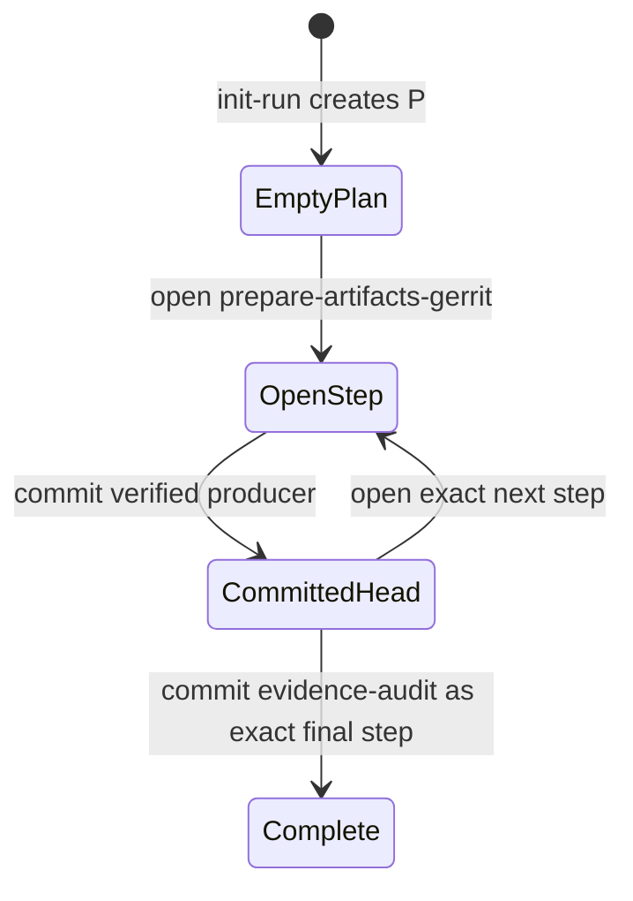
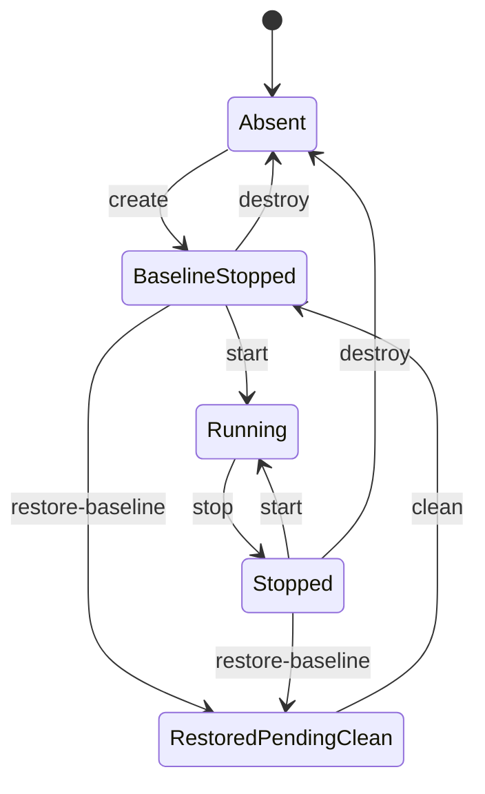

# Simulation Lifecycle State Model

This document owns two coordinated state machines shared by Docker and VM: the
simulation resource lifecycle and the product run plan. It defines their
separate persisted state, transitions, records, and guards, plus the active-run
binding that coordinates them. It realizes, but does not override,
`docs/contracts/lifecycle-contract.md`. Public command descriptions remain in
`simulation/docs/shared/simulation-model.md` and the backend simulation guides.

`simulation/docs/shared/generated-state-layout.md` owns the locations and
custody classes of the records described here. A path named in this document
locates a state record; it does not transfer directory-layout authority here.

`simulation/docs/shared/run-plan-transition-protocol.md` separately owns the
cross-layer verification and publication protocol: which producer records the
harness must verify and when it may invoke a transition defined here. The
protocol does not add state dimensions, run-step identifiers,
classifications, or transition effects. This state model does not define
product-owner postconditions, producer-record content, or transaction steps.

## Two Coordinated State Machines

The model contains two state machines and one coordination layer. They are
separate authorities even though some public commands coordinate both:

| Model | State tuple | Purpose | Durable history |
| --- | --- | --- | --- |
| Simulation resource lifecycle (`R`) | Presence, power, reset gate | Create, power, restore, clean, and destroy the reusable environment | Simulation operation records and set/baseline metadata |
| Product run plan (`P`) | Committed run-step head, open activity | Order and resume applicable product checkpoint execution inside that environment | Product producer records and hash-linked run-step records |
| Execution coordination state (`C`) | Active-run claim, input readiness, derived durable-content classification | Bind one immutable run plan to one simulation set and guard cross-machine commands | `active-run.env`, effective-input binding, and classification result |

The separation rules are:

- Resource commands may change `R`; they never advance the committed product
  run-step head in `P`.
- `open-run-step` and `commit-run-step` change `P`; they never create, power,
  restore, clean, or destroy backend resources in `R`.
- `C` authorizes one `P` instance to use one `R` instance and derives guards
  from both. It is not a third progression machine and does not make an
  operation record a product record.
- `init-run`, `start`, and `clean` are coordination commands. Their exact
  cross-machine effects are listed in the coordination matrix below.

A command is valid only when its owning state-machine guard and the applicable
coordination binding both pass.

## Product Run-Plan State Machine

### Run-Step Mapping

The product checkpoint semantics and boundaries come from
`docs/contracts/lifecycle-contract.md`. Simulation waives Input review or
source selection and OS dependency provisioning from its product run plan.
`init-run` owns simulation run-state and source-selection publication;
`create` owns resource, OS dependency, and baseline lifecycle. Both write
simulation operation records, not product producer or run-step records. The
first successful `start` publishes effective inputs before any product run
step.

The following table maps product checkpoint families to the complete simulation
run-step identifier chain in strict predecessor order. Each
role-qualified identifier represents one product checkpoint instance. Within
each role-qualified family, `<role>` expands in order to `gerrit`,
`jenkins-controller`, then `jenkins-agent`. A family is fully expanded before
the next family begins, and each expansion advances independently.

| Product checkpoint family | Run step identifier |
| --- | --- |
| Artifact preparation | `prepare-artifacts-<role>` |
| Artifact staging | `stage-artifacts-<role>` |
| Role-local setup | `configure-role-<role>` |
| Role-local validation | `validate-role-<role>` |
| Integration preflight | `integration-preflight` |
| Shared integration setup | `configure-integration` |
| Cross-role validation | `validate-integration` |
| End-to-end trigger verification | `prove-integration` |
| Evidence audit | `evidence-audit` |

The concrete role expansions and five unqualified identifiers in the final
column are the only non-`none` values accepted by `active_step` and
`last_step`. Backend lifecycle commands never advance this chain.
Simulation has no Reviewed Access product checkpoint, wait, or resume path.

The chain therefore begins exactly:

```text
prepare-artifacts-gerrit
prepare-artifacts-jenkins-controller
prepare-artifacts-jenkins-agent
```

Input selection and OS dependency preparation are already bound simulation
operations when this chain begins.

### Run-Plan Transition Graph



Opening a step does not advance the committed head. Failure leaves the prior
head authoritative; only a successful `commit-run-step` moves to the next
committed head.

## Identity And Namespace Derivation

`HARNESS_SET_ID` is canonical input, not a value that backends normalize. It
must match this grammar and defaults to `default` when omitted:

```text
^[a-z0-9]([a-z0-9-]{0,22}[a-z0-9])?$
```

The value is 1-24 lowercase ASCII letters, digits, or internal hyphens. An
invalid value fails before generated-state or backend mutation. The exact
accepted value names the set root and lock and derives the primary backend
namespace injectively:

```text
Docker Compose project: loopforge-docker-<set-id>
VM libvirt prefix:      loopforge-vm-<set-id>
```

These namespaces are backend metadata, not operator inputs. Short
backend identifiers with stricter limits, such as a Linux bridge name, use a
versioned SHA-256 derivation over the backend, exact set ID, and resource kind,
for example `lf-<12-hex>`. The backend must still verify full ownership
metadata; a short-name collision blocks and never adopts another set's
resource.

## State Machine State Tuples

### Simulation Resource Lifecycle State (`R`)

| Dimension | States | Meaning |
| --- | --- | --- |
| Resource presence | `absent`, `present` | Whether the selected backend resources and baseline exist |
| Power | `not-applicable`, `stopped`, `running` | Runtime power state; absent resources use `not-applicable` |
| Reset gate | `normal`, `restored-pending-clean` | Whether successful restoration requires cleanup before further execution |

### Product Run-Plan State (`P`)

| Dimension | States | Meaning |
| --- | --- | --- |
| Run-plan progression | `none` or the last valid run-step identifier | Run-scoped product progression bound to the active run and commit-time inputs and baseline state |
| Run-step activity | `idle`, `observing`, `mutating` | Whether no product step is open, an observational step is open, or product mutation is open |

### Execution Coordination State (`C`)

| Dimension | States | Meaning |
| --- | --- | --- |
| Run ownership | `unclaimed`, `claimed(<run-id>)` | Whether `active-run.env` authorizes one immutable product run plan to use the set |
| Input publication | `pending`, `ready` | Whether only source templates are bound or stable effective helper inputs have been atomically published |
| Durable content classification | `none`, `baseline`, `exact-bound`, `active-incomplete`, `conflicting` | Derived agreement among backend content, baseline, active run, and product run-plan state |

The durable-content classification is a guard derived from `R`, `P`, and `C`;
it is not progression in either state machine. A product mutation may change
the classification without performing a resource lifecycle transition.

`exact-bound` means all durable state currently present is complete and bound
to the last committed run step identifier; later phases may still
be absent.
`active-incomplete` means a mutating run-step attempt is in progress,
interrupted, or only partially applied. Normal product commands may continue
only when their exact run-step predecessors hold. A stopped
`active-incomplete` set
cannot be restarted because `start` supports only baseline or exact-bound
durable state. `conflicting` state always blocks normal mutation.

## Core Invariants

- `HARNESS_SET_ID` identifies one reusable simulation set and defaults to
  `default` when omitted.
- `HARNESS_RUN_ID` identifies exactly one immutable attempt and is never
  reused.
- A set has at most one active run.
- The active-run pointer, run marker, run-plan state, runtime config, source and
  effective input fingerprints, backend ownership, baseline identity, and
  run-step record chain must agree.
- `stop` preserves every state dimension except power.
- `restore-baseline` changes durable content to `baseline` but deliberately
  preserves active-run ownership and generated run state.
- Successful restoration sets `restored-pending-clean`.
- Only `clean` or set destruction removes active-run ownership.
- Retained artifacts, evidence, and bounded logs remain bound to their original
  run root.
- Backend resource namespaces are derived from the backend and set ID and never
  from the run ID.

## Persistence And Concurrency

Each set has one stable lock outside its deletable set root:

```text
generated/simulation/<backend>/locks/<set-id>.lock
```

Mutating commands take a nonblocking exclusive lock. `status`, `audit-state`,
and other state-reading commands take a shared lock. Contention fails with
`set busy`; commands do not wait indefinitely or bypass the lock. The
composite `run` command acquires and releases the lock through each internal
command rather than holding one lock across the whole run plan.

The set-scoped `active-run.env` is the authoritative ownership and reset-gate
record. It has a strict fixed-key schema such as:

```text
schema_version=1
backend=docker
set_id=default
run_id=run-A
resource_namespace=loopforge-docker-default
run_marker_sha256=<sha256>
baseline_fingerprint=<sha256-or-none>
state=active
restore_operation_record_sha256=none
```

After successful restoration, `state` is `restored-pending-clean` and
`restore_operation_record_sha256` names the matching immutable simulation
operation record. Parsers must not shell-source this file. Unknown, duplicate,
missing, malformed, or out-of-order fields fail closed.

The run-scoped `run-plan-state.env` is authoritative only for progression of
the run selected by `active-run.env`. It has a strict fixed-key schema such as:

```text
schema_version=1
backend=docker
set_id=default
run_id=run-A
run_marker_sha256=<sha256>
baseline_fingerprint=<sha256-or-none>
source_inputs_fingerprint=<sha256>
input_state=pending
effective_inputs_fingerprint=none
activity=idle
active_step=none
last_step=none
last_run_step_sha256=none
```

The active-run pointer selects the only run-plan state allowed to affect the
set. A retained run-step record without that matching pointer is historical
output and cannot claim or resume the set. The pointer does not copy the
mutable run-plan-head hash; both records bind independently to the immutable
run marker and must agree on their shared identities and fingerprints.

The immutable run marker binds the private source snapshots and records
`source_inputs_fingerprint`. On the first successful `start`, the harness
renders stable helper inputs in a private sibling directory and atomically
publishes `host/runtime-inputs/` plus a strict
`host/state/effective-inputs.env` record such as:

```text
schema_version=1
backend=docker
set_id=default
run_id=run-A
run_marker_sha256=<sha256>
source_inputs_fingerprint=<sha256>
effective_inputs_fingerprint=<sha256>
```

The effective-input record is published before run-plan state changes to
`input_state=ready` with the matching fingerprint. A repeated `start` verifies
the existing directory and record byte-for-byte and does not republish them.
Every run step requires `input_state=ready` and an exact baseline fingerprint.

Run-step records are immutable and hash-linked through
`last_run_step_sha256`. Each record identifies the backend, set, run, baseline,
source and effective inputs available at commit time, step, predecessor,
activity kind, `status=complete`, `producer_record_sha256`, and timestamps.
Unknown run-step identifiers or invalid predecessor ordering fail closed.

Only successfully verified product checkpoint attempts produce run-step
records. Other outcomes do not add a run-step record or advance the chain. The
transition protocol owns which producer record may supply
`producer_record_sha256`; the mapping above owns every run-step identifier and
its strict predecessor order.

## Run-Plan State Transitions

The state model exposes two run-step transitions. Their guards and effects are
state-model facts; proof ownership and invocation order belong to
`simulation/docs/shared/run-plan-transition-protocol.md`.

| Transition | Guard | Successful ledger effect |
| --- | --- | --- |
| `open-run-step(<step>, <activity>)` | Activity `idle`, exact next step, step-specific input/baseline guards, and `<activity>` is `observing` or `mutating` | Set `active_step` and `<activity>` without changing the committed run-plan head |
| `commit-run-step(<record>)` | Open activity matches the structurally valid, exact-predecessor record and its commit-time run/input/baseline bindings | Append the hash-linked run-step record, advance `last_step` and `last_run_step_sha256`, then clear the active step and return to `idle` |

These are internal transitions, not public commands. `open-run-step` atomically
publishes the open activity without changing the committed head.
`commit-run-step` writes and verifies the immutable record before atomically
advancing that head. A failure before head replacement leaves the prior
committed head authoritative; an unreferenced record cannot advance
progression.

An open `mutating` run step classifies durable state as
`active-incomplete`. An open `observing` run step leaves unchanged
durable content exact-bound but blocks other run step progression.
Failure before `open-run-step` leaves
the ledger unchanged. Failure after it leaves the activity open: mutation uses
explicit recovery, while observation may retry only the same run step against
the unchanged head and inputs. No failure path calls `commit-run-step`.

## Coordination Transitions

Initialization writes the complete run root, immutable run marker, and initial
run-plan state before atomically publishing `active-run.env` last. A crash
before pointer publication consumes the run ID but does not claim the set.
Initial run-plan state has effective inputs pending and no committed run step.
`init-run` records source selection in its operation record. For an absent set,
`create` records resource creation, OS dependency preparation, and clean
baseline capture in its operation record. The first successful `start` verifies
the selected baseline and target access, then publishes the effective bundle
and binding record without changing the committed run-step head. A failure
before ready publication leaves product steps blocked and never appears as
effective-input success.
Restoration writes and verifies its immutable operation record before
atomically changing the pointer gate. Cleanup removes known mutable paths
idempotently, preserves
the immutable run marker, run-step records, evidence, artifacts, and logs,
then removes the active-run pointer last.

Once the pointer records `restored-pending-clean`, `clean` authorization comes
from that strict pointer, its immutable run marker, and matching restoration
operation record. A retry may find any known mutable cleanup target, including
`run-plan-state.env`, already absent. That absence is idempotent cleanup
progress, not a stale-state fallback. Missing or mismatched authorization
records still block. Read-only inspection may report `cleanup-in-progress`
until the pointer is removed.

## Exact-Bound Classification

The shared state layer owns classification; role and integration commands own
their product checkpoint postconditions. The classifier reads all state under the set
lock and returns:

- `baseline` when no target-mutating product checkpoint has completed, no mutation is
  open, and the selected clean baseline is exact;
- `exact-bound` when the pointer, marker, ownership, baseline, source and
  effective inputs, run-plan head, and immutable run step chain agree with no
  open mutation;
- `active-incomplete` when a target mutation was published but its completion
  record and idle head were not published; or
- `conflicting` when identities, fingerprints, ownership, hashes, run step
  order, or backend state disagree.

`start` consumes this classification but does not rerun run step validation
or infer setup success from service state. An interrupted observation may
leave durable content `exact-bound` while run step progression is blocked.

## Coordinated Resource And Claim Combinations

| Name | Resources | Power | Durable content | Ownership | Reset gate |
| --- | --- | --- | --- | --- | --- |
| Absent and unclaimed | absent | not-applicable | none | unclaimed | normal |
| Absent but claimed | absent | not-applicable | none | claimed | normal |
| Baseline stopped and unclaimed | present | stopped | baseline | unclaimed | normal |
| Baseline stopped and claimed | present | stopped | baseline | claimed | normal |
| Baseline running | present | running | baseline | claimed | normal |
| Active run running | present | running | active-incomplete or exact-bound | claimed | normal |
| Exact-bound stopped | present | stopped | exact-bound | claimed | normal |
| Recovery-required stopped | present | stopped | active-incomplete or conflicting | claimed | normal |
| Restored pending clean | present | stopped | baseline | claimed | restored-pending-clean |

The same durable baseline appears in three combinations with different command
rights. A newly created or newly claimed baseline may start. A restored
baseline may not start until `clean` releases the old run and `init-run` claims
the set for a new run.

## Cross-Machine Coordination Matrix

This matrix is the only place where one event's effects across `R`, `P`, and
`C` are combined:

| Event | Resource lifecycle (`R`) | Product run plan (`P`) | Coordination state (`C`) |
| --- | --- | --- | --- |
| `init-run` | Preserve absent resources or the stopped baseline | Create a new empty run plan | Claim the set, bind source inputs, and set inputs pending |
| `create` | Create or verify resources, OS dependencies, and baseline | Preserve the empty committed head | Preserve the claim and classify the exact baseline |
| `start` | Start or verify resources and target access | Preserve the committed head and activity | Publish effective inputs and recompute classification |
| `open-run-step` / `commit-run-step` | Preserve presence, power, and reset gate | Open activity or advance the committed head | Preserve the claim and recompute durable-content classification |
| `stop` | Change power to stopped | Preserve run-step state | Preserve claim, inputs, and classification |
| `restore-baseline` | Restore baseline content and set `restored-pending-clean` | Preserve the old mutable head and immutable chain for diagnosis | Preserve the old claim and classify content as baseline |
| `clean` | Keep baseline resources and clear the reset gate | Retire active custody without changing immutable run history | Release the old claim and remove mutable input binding |
| `destroy` | Remove ownership-validated resources and set state | Preserve retained run history outside the set root | Remove the set-side claim and resource classification |

An entry in more than one column is coordinated publication, not shared
progression. In particular, `restore-baseline` and `clean` never rewind, open,
or commit a product run step.

### Command Guards

| Command | Required state | Effect | Preserves |
| --- | --- | --- | --- |
| `preflight` | None; read-only host prerequisites | Reports prerequisite state | All simulation state |
| `init-run` | Set unclaimed, reset gate `normal`, unused run ID; resources absent or stopped at baseline | Publishes source-bound run state and the `init-run` operation record with an empty run-plan head | Existing baseline and backend resources |
| `create` | Claimed run with no committed run step; resources absent, or exact stopped existing baseline when invoked directly | Creates or verifies resources, prepares or verifies simulation OS dependencies, captures or verifies the clean baseline, and writes the `create` operation record | Run ownership, selected inputs, and any exact existing baseline |
| `start` | Claimed run, reset gate `normal`, durable content `baseline` or `exact-bound`; resources stopped or already running | Starts or verifies resources, refreshes live target access, publishes stable effective inputs once when pending, or returns `state=already-running` | Run ID, run steps, durable content, resource identity, ready effective inputs |
| `stop` | Claimed ownership-valid set with resources running or already stopped | Gracefully stops running services and backend runtime, or returns `state=already-stopped` | Run ID, run steps, durable content, resources, evidence |
| `restore-baseline` | Claimed run, resources stopped, ownership-valid matching baseline, reset gate `normal` | Resets durable content to baseline, writes the restore operation record, and sets `restored-pending-clean` | Active run, mutable run state, retained review output, reusable resources |
| `clean` | `restored-pending-clean`, matching successful restore operation record, claimed run, resources stopped | Removes mutable run state and active-run pointer; returns to baseline stopped and unclaimed | Baseline, reusable resources, retained artifacts, producer and operation records, and logs |
| `destroy` | Resources absent or stopped and selected ownership validated | Removes owned set state, or returns `state=already-absent` for a fully absent unclaimed set | Retained run roots and review output |
| `status` | Selected state resolvable, including absent or unclaimed; read-only | Reports set, run, power, durable classification, reset gate, and available access state | All simulation state |
| `audit-state` | None beyond selected identity inputs; read-only | Reports generated/backend consistency | All simulation state |
| Product run-plan phases | Claimed run, resources running, reset gate `normal`, effective inputs ready, exact baseline, exact preceding run step and state classification | Invokes only the product owner and commits the corresponding run step after verification | Set/run/input binding and prior producer records |
| `run` | State matches one supported fresh, resume, or complete case | Runs the normal run plan from the first required command and leaves the set running | Never performs cleanup, restoration, destruction, or audit |

Running resources block `create`; callers use `stop` first. `create` also
blocks an unclaimed set, `restored-pending-clean`, and partial, drifted,
unowned, or mismatched state. Existing-state verification uses set-scoped
metadata and must not reset durable state.

`run` is state-aware:

- absent and unclaimed state runs
  `preflight -> init-run -> create -> start -> product run plan`;
- an unclaimed retained baseline initializes a run, starts, and enters the
  product run plan without invoking `create`;
- an exact active run resumes at the next required phase, starting it first
  when stopped;
- an exact completed run is made running when necessary and returns
  non-mutating `already-complete`; and
- interrupted, partial, conflicting, restored-pending-clean, explicit run-ID
  mismatch, pending effective inputs outside `start`, or changed input
  fingerprints block.

When `HARNESS_RUN_ID` is omitted for a claimed set, `run` resolves the current
pointer and reports `mode=resume`. It never invokes `stop`,
`restore-baseline`, `clean`, `destroy`, or `audit-state`, and it leaves the set
running.

Idempotent success never hides contradictory state. `start` already running
succeeds only for an ownership-valid baseline or exact-bound set. `stop`
already stopped reports the durable classification and reset gate without
claiming run-plan health. `status` succeeds for every coherent absent,
unclaimed, stopped, or running state; malformed or contradictory state reports
`conflicting` and exits nonzero. `destroy` already absent succeeds only when
both backend resources and set ownership state are absent. An absent-but-
claimed set left by failed creation may be released only when its pointer,
marker, namespace, and retained metadata are ownership-valid. Metadata that
claims missing resources is conflicting and is not reinterpreted as absent.

## Simulation Resource Lifecycle State Machine

### Transition Graph



Product operations do not appear in this graph because they do not transition
resource presence, power, or the reset gate. They may change the derived
durable-content classification in `C`. `destroy` requires validated ownership;
retained run roots remain after destruction.

## Restored-Pending-Clean Gate

Successful `restore-baseline` is a one-way boundary for the active run. Its
configured durable state has been erased, while its mutable run-plan head,
immutable run-step records, and active-run pointer remain for validation,
diagnosis, and cleanup authorization.
The run cannot resume and the set cannot be claimed by another run.

While the reset gate is `restored-pending-clean`:

| Allowed | Blocked |
| --- | --- |
| `preflight`, `status`, `audit-state`, `clean`, `destroy` | `init-run`, `create`, `start`, `ssh`, artifact phases, role phases, integration phases, `reboot`, and another `restore-baseline` |

This gate prevents old run steps from being combined with baseline durable
state. `clean` is the normal exit. `destroy` is the destructive exit when the
reusable set should not be retained.

If restoration fails, the gate is not recorded as successful and `clean` must
not release the set. The failed run remains active. Operators inspect with
`audit-state` and retained bounded logs, then use only an ownership-valid
explicit recovery action; normal run-plan commands remain blocked.

## Full Reuse Sequence

```text
run A exact-bound and running
  -> stop
     exact-bound, stopped, claimed by run A
  -> restore-baseline
     baseline, stopped, claimed by run A, restored-pending-clean
  -> clean
     baseline, stopped, unclaimed; run A review output retained
  -> init-run
     baseline, stopped, claimed by new run B, effective inputs pending
  -> start
     retained baseline and target access verified for run B;
     stable effective inputs published
```

The reuse path does not call `create`; `start` verifies the retained baseline
before publishing effective inputs. After `destroy`, a new sequence requires
`init-run -> create -> start` because resources and baseline are absent.

## Failure Behavior

- Missing or mismatched markers, ownership, baseline identity, or fingerprints
  block before mutation.
- Source templates are never passed to helpers. Stable effective inputs are
  published once and never rewritten; DHCP and equivalent live transport hosts
  are refreshed outside their fingerprints.
- No command repairs stale state, reads legacy markers, or infers ownership from
  partial resources.
- Read-only inspection does not clear gates or manufacture readiness.
- A failed `start` leaves the same run active and does not create a new run ID.
- A stopped incomplete or conflicting run uses explicit restoration and cleanup
  or destruction; it cannot use `start` to continue.
- Record files use strict parsers and atomic same-directory temporary-file
  replacement; they are never loaded with shell `source`.
