# VM Simulation Command Sequences

This document records internal command sequence diagrams for the VM simulation
harness. `simulation/docs/vm/vm-simulation.md` owns the public command contract, and
`simulation/docs/vm/implementation-design.md` owns the VM module boundary
model. These diagrams validate how the public commands should flow through the
folded VM modules.

Shared guards, checkpoint opening/commit, predecessor order, and failure effects
are intentionally omitted. `simulation/docs/shared/lifecycle-state-model.md` and
`simulation/docs/shared/checkpoint-acceptance-protocol.md` wrap each applicable phase;
the diagrams show only VM-specific module flow.

The diagrams use capability-shaped APIs below `lifecycle.sh`. Command-shaped
APIs should stay in `lifecycle.sh`.

## preflight

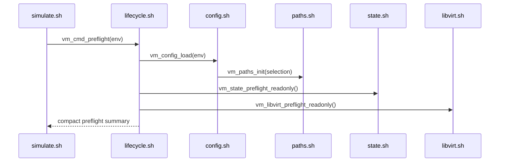

## init-run

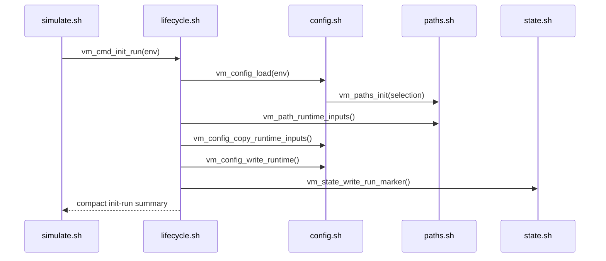

## create

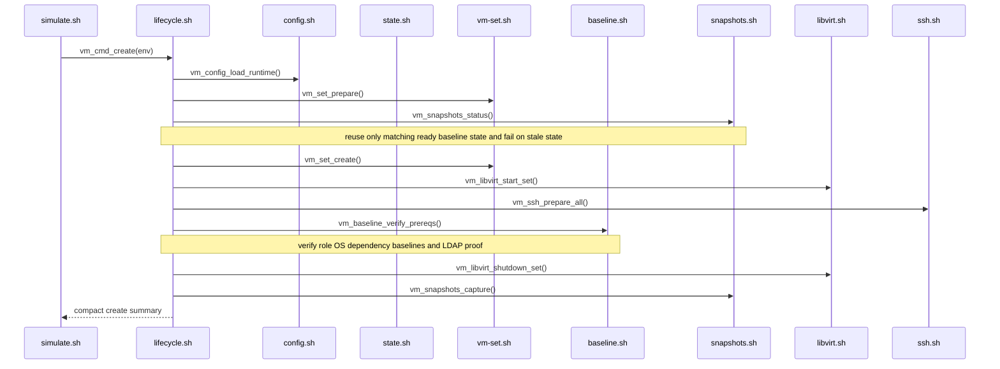

## start

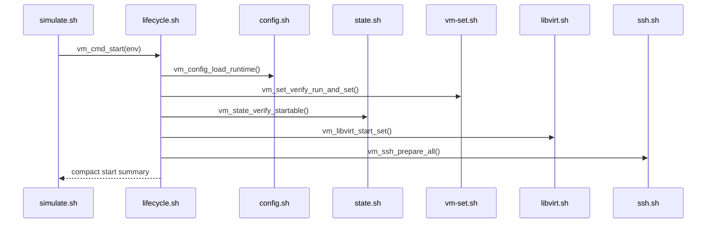

## status

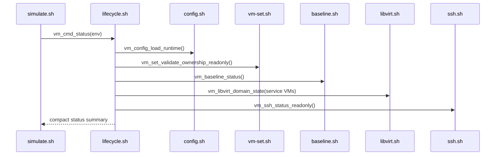

## ssh

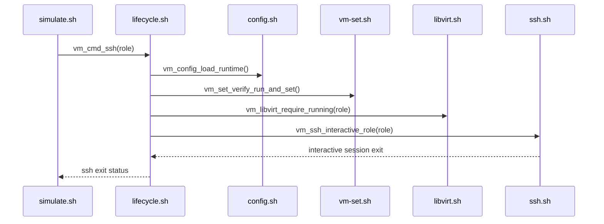

## prepare-artifacts

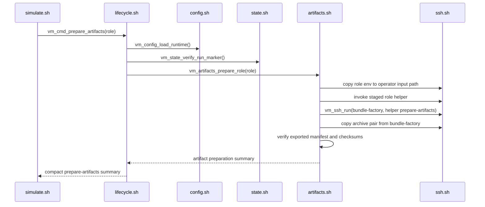

## stage-artifacts

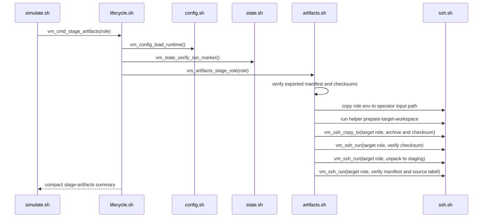

## configure-role

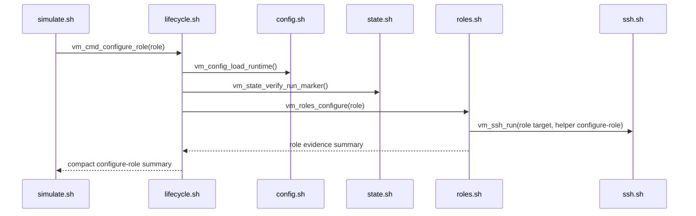

## validate-role

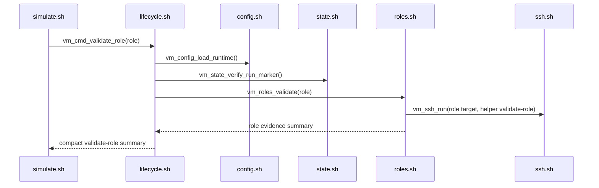

## configure-integration

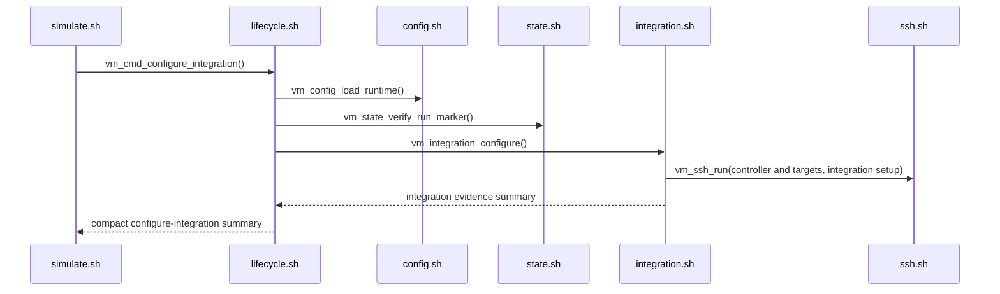

## validate-integration

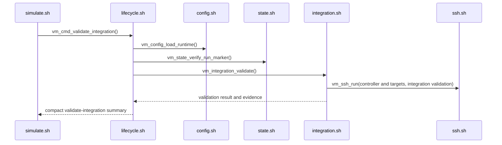

## prove-integration

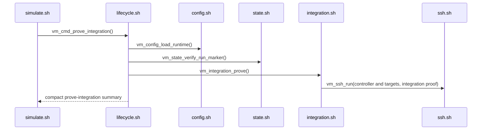

## reboot

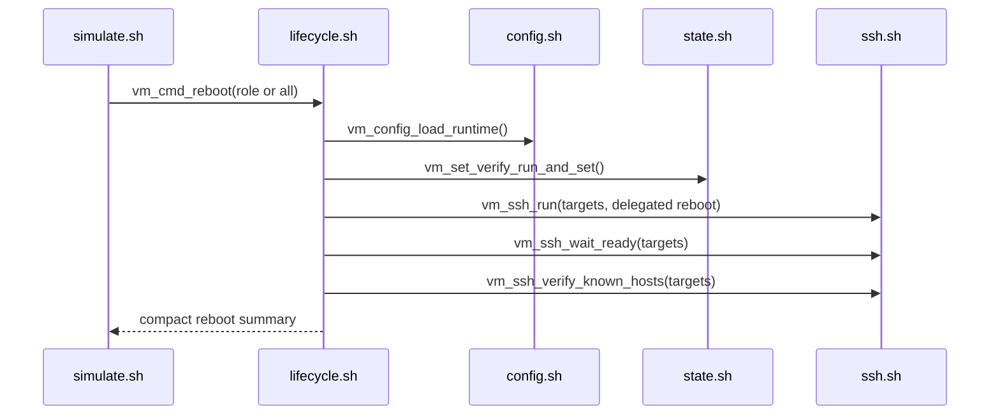

## audit-state

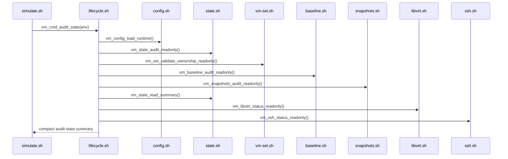

## stop

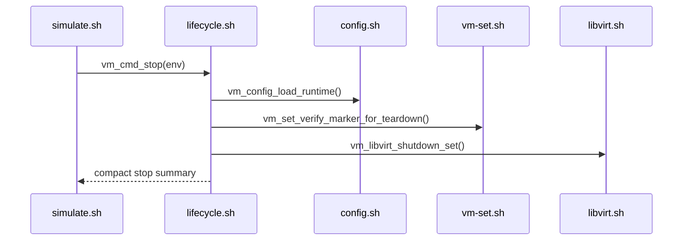

## restore-baseline

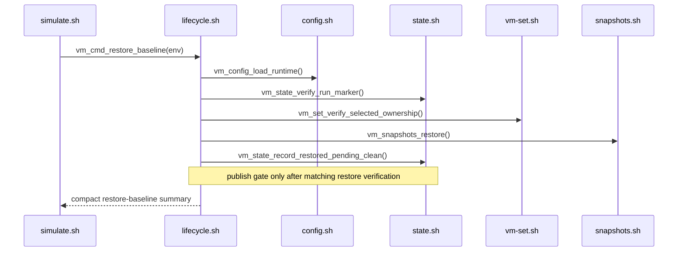

## clean

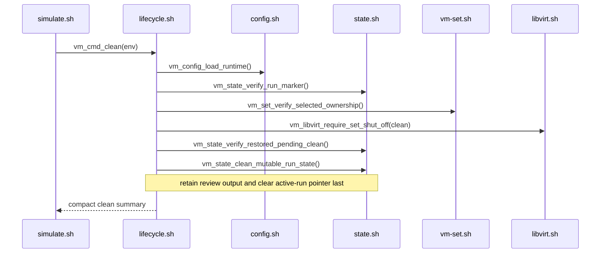

## destroy

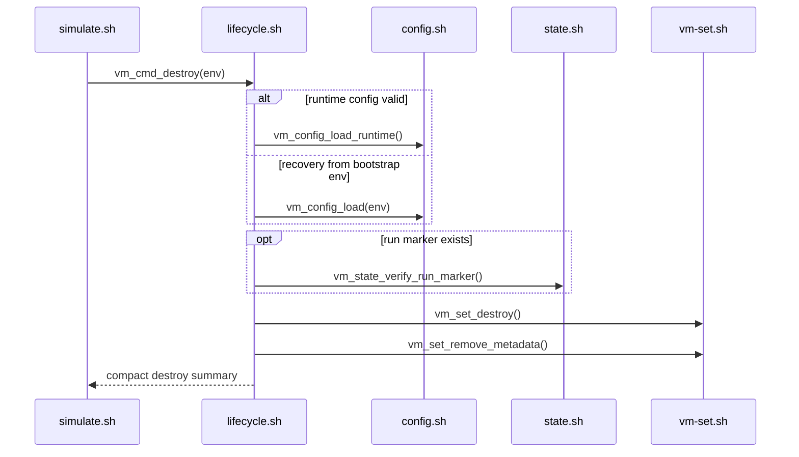

## run

`vm_cmd_run` applies the shared composite order through VM command entrypoints.
It adds no VM-only workflow phase; `reboot` remains an explicit command outside
the composite.

The shared harness design owns plan selection. This VM binding classifies the
selected state, then sends every command in the selected plan through the same
`vm_cmd_*` handler and lock mode used by direct CLI invocation. Individual
command diagrams above own the capability calls below each handler.

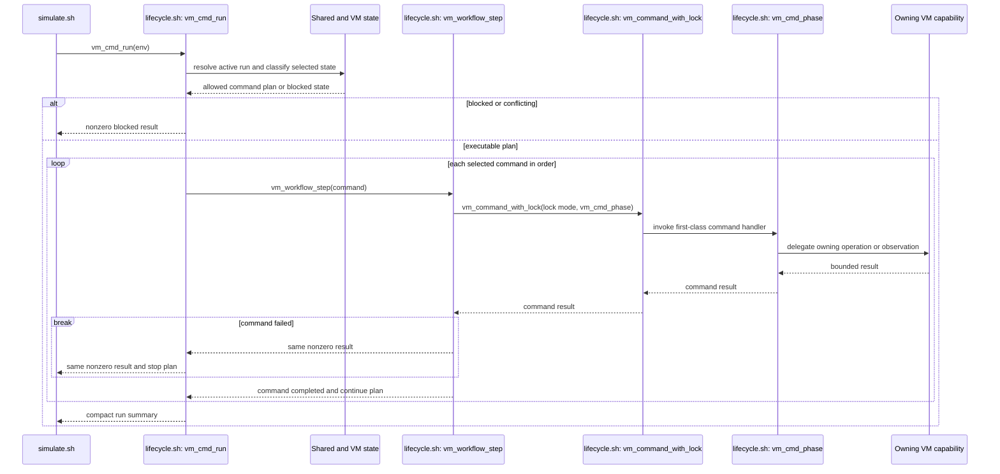

The selected plan includes the intentional `status` observation described by
the shared harness design. A stopped resumable or completed run therefore uses
`start -> status`; an already-running completed run uses `status` before its
`already-complete` summary. Neither path repeats a completed workflow
checkpoint.
