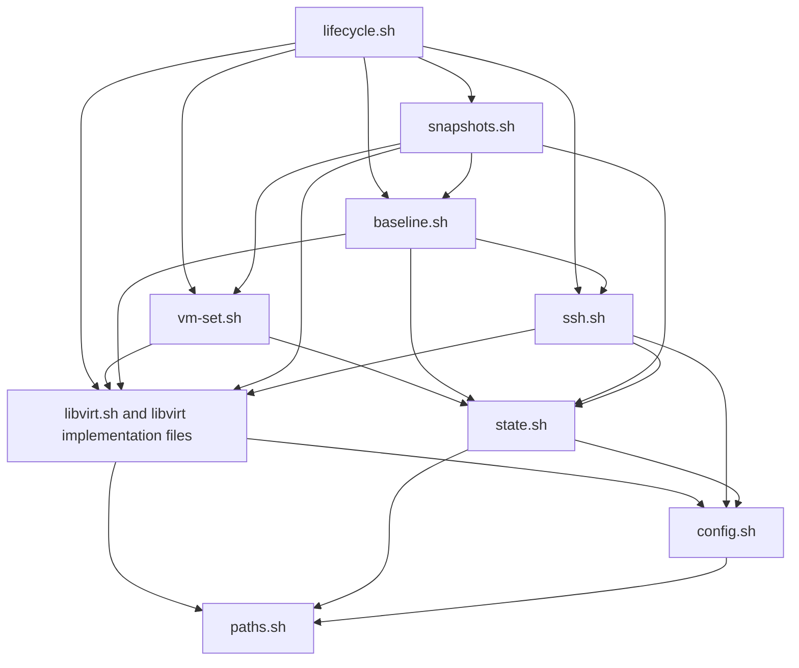

# VM Libvirt Module Refactor Decision

## Status And Authority

This decision is implemented. The accepted module boundaries, dependency
rules, and compatibility policy below describe the current VM harness.

`simulation/docs/vm/vm-simulation.md` remains the public VM simulation command contract.
`simulation/docs/vm/implementation-design.md` owns VM harness module
boundaries. This document is
the task-local implementation companion for the accepted `libvirt.sh`
refactor: it records the measured construction, decision rationale, target
module responsibilities, migration sequence, and verification requirements.

Read this document before changing VM libvirt operations, VM-set ownership,
baked-image handling, seed media, baseline snapshots, or guest baseline and
LDAP verification.

## Context

The initial folded module layout deliberately placed VM infrastructure in
`simulation/vm/lib/libvirt.sh`. That was appropriate while M1 through M3 were
establishing the CLI, libvirt preflight, and basic domain lifecycle. M4 and M5
then added dependency-prepared image baking, libvirt-managed storage volumes,
guest baseline proof, LDAP seed and reachability proof, baseline snapshots,
rollback, ownership verification, and fail-closed destruction.

At the accepted M5 implementation baseline, `libvirt.sh` has:

- 2,041 lines;
- 121 host-side `vm_libvirt_*` function definitions;
- 39 functions referenced by another VM module or test;
- 82 functions used only inside `libvirt.sh` despite their public-looking
  names;
- five additional helper functions embedded in guest shell scripts;
- 26 heredoc starts, including XML, cloud-init, metadata, and guest scripts;
- ten Python invocations for address, size, and XML handling; and
- 59 `virsh` references across queries, mutation, validation, and cleanup.

The growth followed milestone delivery rather than an up-front monolith:

| Milestone change | Resulting lines | Resulting `vm_libvirt_*` functions |
| --- | ---: | ---: |
| M1 harness scaffold | 9 | 2 |
| M2 libvirt preflight | 125 | 14 |
| M3 VM lifecycle | 486 | 42 |
| Initial M4 LDAP proof | 645 | 51 |
| Base-image baking | 1,092 | 81 |
| M4 readiness hardening | 1,427 | 95 |
| Libvirt-managed images | 1,681 | 110 |
| M5 snapshot lifecycle | 2,041 | 121 |

File size is evidence of accumulated responsibility, but it is not the sole
reason for this decision. The decisive concerns are ownership, dependency
direction, API clarity, and the cost of safely changing independent VM
infrastructure capabilities.

## Current Anatomy

The file is constructed mostly in dependency-first order. It starts with
derived identities and paths, adds low-level libvirt queries and renderers,
then builds progressively higher-level workflows on top.

| Current lines | Functions | Responsibility |
| --- | ---: | --- |
| 1-218 | 33 | Constants, resource identity, preflight, paths, and baked-image selection |
| 219-610 | 21 | Pool, volume, domain, and network primitives plus XML rendering |
| 611-932 | 11 | Cloud-init seed media, volume XML, disk metadata, and disk identity |
| 933-1291 | 17 | Package policy, temporary bake VM, image publication, and cache validation |
| 1292-1332 | 3 | Network, machine, and VM-set creation orchestration |
| 1333-1562 | 7 | Per-machine package verification and LDAP configuration and proof |
| 1563-1690 | 6 | Baseline prerequisite checks, snapshot records, and snapshot capture |
| 1691-1897 | 9 | Selected-set ownership, rollback, teardown validation, and destruction |
| 1898-2041 | 14 | Start, shutdown, address discovery, status, resource discovery, and audit |

This order makes individual flows possible to trace, but it mixes four levels
of abstraction in one namespace:

1. Pure derived values such as names, paths, MAC addresses, and fingerprints.
2. Thin libvirt operations such as `pool-info`, `vol-dumpxml`, `domstate`, and
   `net-dhcp-leases`.
3. Capability workflows such as image baking, LDAP readiness, snapshot
   capture, and selected-set destruction.
4. Cross-capability orchestration that also reads or writes harness state and
   invokes the target SSH control plane.

## Problems To Resolve

### Public Surface Does Not Match Actual Use

Every host-side function uses the `vm_libvirt_*` public API shape even though
most functions are file-private. This conflicts with the design convention
that module-private helpers use `__vm_*` or remain local. It also makes it hard
to tell which functions callers may depend on during a refactor.

### State And Infrastructure Depend On Each Other

`state.sh` calls libvirt functions to derive and validate VM-set markers,
baked-image state, snapshots, and live selected-resource status. In the other
direction, `libvirt.sh` calls state functions before baseline capture,
rollback, ownership validation, and destruction. The resulting dependency
cycle prevents `state.sh` from acting as a foundation module and obscures
which layer owns VM-set consistency.

### Guest Verification Is Mixed With Libvirt Primitives

Package and LDAP verification use `vm_ssh_*` from inside `libvirt.sh`. Those
checks are required before the clean baseline snapshot, but they operate over
the target OS control plane rather than through libvirt. They need a baseline
capability that may coordinate libvirt, SSH, and state without making the
low-level libvirt package depend on `ssh.sh`.

Image-bake SSH is different: it is private infrastructure access to the
temporary bake domain before image publication. It stays with image baking and
does not become target checkpoint transport.

### Independent Failure Domains Share One File

Storage identity, image publication, cloud-init generation, LDAP verification,
snapshot rollback, and destructive cleanup have different invariants and
failure consequences. Changes to any one currently require reviewers to
navigate the complete file and its shared global namespace.

### Tests Protect Behavior But Are Expensive To Extend

The M3 lifecycle and LDAP tests exercise the public CLI through substantial
fake-libvirt environments. That is useful characterization coverage, but the
fixtures duplicate many `virsh` behaviors. Production extraction should use
the existing CLI tests first; fixture consolidation should follow as a
separate logical change so production and test architecture are not rewritten
simultaneously.

## Decision Drivers

The refactor must:

- preserve all accepted M1 through M5 command behavior;
- preserve marker schemas, generated paths, evidence, and terminal summaries;
- preserve libvirt-mediated storage inspection and deletion;
- preserve fail-closed ownership checks before rollback or destruction;
- preserve the target-like post-baseline control-plane boundary;
- keep VM implementation independent of Docker harness internals;
- keep M6 artifact work outside this refactor;
- remain reviewable and testable as Bash modules; and
- require no remote KVM mutation for the structural change itself.

## Options Considered

### Keep The Folded File

Rejected. The original folded layout was intentional, but its documented split
triggers have fired. Continuing to add capabilities would preserve the state
cycle and ambiguous public surface.

### Perform Only A Mechanical File Split

Rejected as the final architecture, but selected as the first migration step.
A mechanical split improves navigation and limits merge conflicts while
retaining the current dependency cycle. It is a useful safety stage, not the
desired end state.

### Rewrite The Infrastructure Layer In Python

Rejected. Python is already appropriate for structured XML and address
parsing, but replacing the harness orchestration language would expand the
change far beyond the demonstrated maintainability problem. It would also
replace accepted behavior and test seams instead of first correcting module
ownership.

### Add A Shared Docker And VM Backend Abstraction

Rejected. VM domains, libvirt storage, seed media, snapshots, and VM-set
ownership are backend-specific. The existing design permits sharing only
proven backend-neutral mechanics under `simulation/lib/`.

### Split By Capability In Stages

Accepted. First extract implementation groups without behavior or API changes.
Then move coordination to capability modules, remove dependency cycles, and
narrow the public shell API under existing tests.

## Target Module Layout

`simulation/vm/lib/libvirt.sh` remains the logical libvirt entrypoint. During
the mechanical extraction it loads the flat `libvirt-*.sh` implementation
files in explicit dependency order. Keeping the files flat preserves existing
syntax-check and repository-boundary discovery patterns.

| Target module | Responsibility |
| --- | --- |
| `libvirt.sh` | Constants, implementation loading, and the stable logical libvirt boundary |
| `libvirt-core.sh` | Libvirt preflight, derived resource identity, generic live queries, domain runtime control, address discovery, and status |
| `libvirt-storage.sh` | Directory pools, volumes, volume XML inspection, disk metadata, backing-image identity, mediated checksums, and storage removal primitives |
| `libvirt-domain.sh` | Network and domain XML, machine definition, SSH-key preparation, and cloud-init seed media for normal and bake domains |
| `libvirt-image.sh` | Package matrix, fingerprints, temporary bake-domain workflow, publication locking, baked-volume markers, and cache validation |
| `baseline.sh` | Guest package verification, LDAP configuration and bind/search proof, consumer reachability, and baseline-readiness markers |
| `snapshots.sh` | Snapshot status, records, capture, verification, and restore coordination |
| `vm-set.sh` | VM-set marker identity, live ownership validation, create composition, teardown validation, destruction, and selected-set audit |

The names describe ownership rather than forcing similarly sized files. A
module may remain small when its boundary is safety-critical, especially
snapshot restore or destructive VM-set cleanup.

## Target Dependencies



The implemented dependency rules are:

`lifecycle -> vm-set/baseline/snapshots -> libvirt/ssh/state -> config/paths`

- `state.sh` handles run-scoped state and generic marker mechanics; it does not
  query libvirt or validate live VM resources.
- `libvirt-*.sh` implementation files do not call `vm_ssh_*` or `vm_state_*`.
- `baseline.sh`, `snapshots.sh`, and `vm-set.sh` are capability coordinators
  allowed to combine lower-level interfaces.
- `ssh.sh` may query the selected domain address and running state through the
  logical libvirt API, but libvirt does not call the target SSH module.
- `lifecycle.sh` remains the only command-shaped orchestration layer.
- No VM module sources or calls Docker harness internals.

## API And Compatibility Policy

The public CLI is unchanged. No command, option, terminal summary, generated
path, marker field, evidence field, or lifecycle prerequisite changes as part
of this refactor.

Mechanical extraction retains current function names so failures can be
attributed to movement rather than simultaneous API redesign. After the files
are loaded and characterized:

- cross-module libvirt capabilities retain the `vm_libvirt_*` prefix;
- baseline entrypoints use `vm_baseline_*`;
- snapshot entrypoints use `vm_snapshots_*`;
- VM-set entrypoints use `vm_set_*`;
- command entrypoints remain `vm_cmd_*`; and
- module-private helpers use `__vm_*`.

Callers must depend on capability entrypoints rather than pool, XML, marker, or
teardown implementation helpers. `simulate.sh` continues to call only
`vm_cmd_*` command functions.

## Migration Sequence

### 1. Establish Characterization Coverage

Record the current source order and externally referenced function set. Ensure
existing tests cover CLI summaries, VM-set marker contents, storage backing
identity, domain attachments, VM-set-local base-image failure paths, LDAP proof,
snapshot reuse and rollback, and destruction refusal on ownership mismatch.

### 2. Extract Without Redesign

Move contiguous function groups into the four `libvirt-*.sh` implementation
files. Keep `libvirt.sh` as the loader, preserve function names, and preserve
runtime source order. Do not move state or SSH coordination in this step.

### 3. Introduce Capability Coordinators

Create `baseline.sh`, `snapshots.sh`, and `vm-set.sh`. Move orchestration and
VM-specific marker ownership into those modules while leaving generic marker
mechanics in `state.sh`.

Update `lifecycle.sh` to call the new capability entrypoints. Preserve the
existing order of validation, mutation, shutdown, snapshot, and cleanup
operations.

### 4. Remove Dependency Cycles

Remove all `vm_libvirt_*` calls from `state.sh`. Remove `vm_ssh_*` and
`vm_state_*` calls from the `libvirt-*.sh` implementation files. Add static
repository guards for both rules.

### 5. Tighten The Internal API

Rename internal-only functions to `__vm_*`, remove confirmed dead functions,
and update command sequence documentation to the implemented capability APIs.
Do not retain wrappers that have no compatibility caller.

### 6. Consolidate Test Infrastructure Separately

Extract duplicated fake-libvirt behavior from the M3 and LDAP tests into a
shared VM test fixture. Keep scenario setup and assertions in their owning
tests. This is a separate logical change after the production boundaries are
stable.

## Verification

Every production refactor slice must run:

```bash
bash -n simulation/vm/simulate.sh simulation/vm/lib/*.sh simulation/lib/*.sh \
  tests/fixtures/vm-libvirt-stub.sh
tests/vm-docs-contract-test.sh
tests/vm-harness-layout-test.sh
tests/vm-harness-terminal-summary-test.sh
tests/vm-harness-status-output-test.sh
tests/vm-harness-vm-set-ownership-test.sh
tests/vm-harness-libvirt-preflight-test.sh
tests/vm-harness-m3-lifecycle-test.sh
tests/vm-harness-ldap-seed-test.sh
tests/vm-harness-m5-lifecycle-test.sh
tests/vm-libvirt-resource-cleanup-tool-test.sh
git diff --check
```

Focused tests must continue to prove:

- read-only preflight and audit do not repair state;
- existing disks fail closed on pool, volume, backing image, or metadata
  mismatch;
- VM-set-local baked base images validate fingerprint, format, capacity, and content;
- LDAP readiness requires exact seeded DNs and consumer bind/search proof;
- snapshot records match live snapshot and VM-set identity;
- rollback leaves every selected domain shut off;
- destruction refuses unowned domains, networks, pools, and volumes; and
- normal success and failure summaries remain byte-for-byte compatible where
  asserted.

The refactor does not require remote KVM execution because it is intended to
preserve already verified behavior. Any remote VM, libvirt, or guest mutation
still requires explicit approval for that target and action.

## Consequences

The VM harness gains more files and an explicit load order. In return, storage,
image publication, guest baseline proof, snapshots, and destructive VM-set
operations become independently reviewable. The public CLI remains stable,
and future M6 through M8 work can depend on capability-shaped APIs without
adding more responsibilities to the libvirt primitive layer.

The decision does not guarantee equal module sizes, remove Bash, change the
libvirt storage model, introduce a plugin system, or make VM and Docker
simulation interchangeable.

## Completion Criteria

The implementation satisfies these criteria:

- the target modules exist with the responsibilities above;
- `libvirt.sh` is a small logical loader rather than the implementation
  monolith;
- `state.sh` no longer calls libvirt;
- libvirt implementation files no longer call target SSH or state modules;
- only intentional cross-module functions retain public prefixes;
- all existing VM tests and new dependency guards pass; and
- the design and sequence companions describe the implemented call flow.
