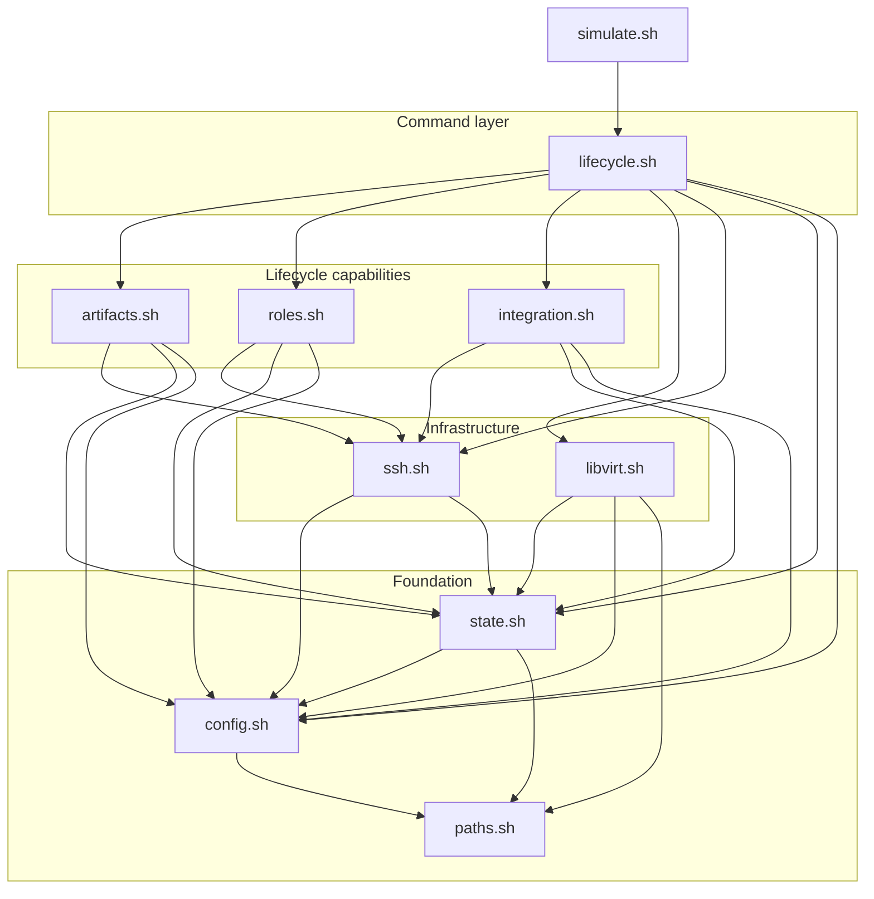

# VM Simulation Harness Implementation Design

This document owns VM-specific module structure, libvirt/KVM implementation
boundaries, provisioning decisions, and historical milestone anatomy.
`simulation/docs/shared/simulation-model.md` owns the common public command
contract, while `simulation/docs/vm/vm-simulation.md` owns VM syntax and
realization deltas. `simulation/docs/shared/harness-design.md` owns the common
harness structure and implemented shared foundation, and
`simulation/docs/shared/lifecycle-state-model.md` owns exact cross-backend state and
command guards. `simulation/docs/shared/checkpoint-acceptance-protocol.md` owns
result and evidence acceptance plus workflow checkpoint publication.

VM simulation stays near target deployment after the clean baseline snapshot.
Libvirt/KVM resources, snapshots, seed media, guest SSH readiness, and VM
resource cleanup remain VM-local realizations of the shared simulation-set
contract.

Per-command internal sequence diagrams are documented in
`simulation/docs/vm/command-sequences.md`.

The accepted detailed decision for splitting the M5 `libvirt.sh` monolith is
documented in `simulation/docs/vm/decisions/libvirt-module-refactor.md`. Read that companion before
changing libvirt operations, VM-set ownership, baked images, seed media,
snapshots, or guest baseline and LDAP verification.

## VM Backend Realization

VM simulation does not mirror Docker module structure where Docker reflects
Compose, containers, bind mounts, loopback ports, or transfer waivers. It does
implement the shared architectural planes with VM-specific mechanisms:

| Shared plane | VM realization |
| --- | --- |
| Backend infrastructure | Libvirt/KVM domains, networks, storage, seed media, snapshots, set ownership, power lifecycle, restoration, and destruction |
| Target control plane | Target OS SSH as the operator account, known-hosts verification, bounded remote execution, file transfer, and narrow delegated privilege |
| Loopforge lifecycle | Artifact flow, helper-owned completion state, validation, proof, evidence, and workflow checkpoint publication |

After the clean baseline snapshot is captured, product checkpoint work must
use target-like interfaces and helper-visible paths. Host-side VM
infrastructure mechanisms remain available for VM lifecycle management, but
they must not complete Loopforge role or integration product checkpoints.

## Current Module Mapping

The VM harness maps the shared conceptual module roles onto this implemented
layout:

| Shared role | VM modules | VM-specific ownership |
| --- | --- | --- |
| Backend entrypoint | `simulate.sh` | VM option parsing, module loading, and dispatch to `vm_cmd_*` functions |
| Command orchestration | `lifecycle.sh` | VM workflow composition, locking mode, summaries, and capability delegation; the only VM command-shaped layer |
| Backend foundation | `paths.sh`, `config.sh`, `state.sh` | VM set/run paths, VM defaults and rendered inventory, and adapters around shared lifecycle state; `state.sh` does not query libvirt |
| Target control plane | `ssh.sh` | Domain-address discovery through the logical libvirt API, host-key custody, SSH readiness, bounded guest commands, transfer, and interactive SSH |
| Simulation-set capabilities | `vm-set.sh`, `baseline.sh`, `snapshots.sh` | Ownership coordination, guest baseline proof, snapshot capture and restore, audit, and destruction |
| Lifecycle capabilities | `artifacts.sh`, `roles.sh`, `integration.sh` | VM artifact transfer, role-helper invocation, integration-helper invocation, and owning-result verification over target OS SSH |
| Backend infrastructure | `libvirt.sh`, `libvirt-core.sh`, `libvirt-storage.sh`, `libvirt-domain.sh`, `libvirt-image.sh` | Libvirt resource primitives, storage, domain and network definitions, seed media, and baked-image publication |

`simulate.sh` and these VM modules consume the backend-neutral implementation
under `simulation/lib/`. No VM module defines an alternate shared identity,
input, locking, permission, or workflow-state model.

## Host Storage Ownership

The host operator owns generated control metadata, including pool and volume
XML, ownership markers, cache fingerprints, locks, logs, and evidence.
Published baked images and per-machine qcow2 disks are libvirt-managed storage
volumes. Their runtime POSIX owner is host-specific and is not part of the
harness contract. Domains attach the libvirt-reported mutable volume path as a
file-backed disk so libvirt applies the host security driver's runtime label.
Read-only base volume validity does not depend on its post-shutdown owner.

The directory-pool backend on the validation host ignored requested volume
owner and group values and created mutable overlays as `root:root 0600`.
Attaching those overlays with a `type='volume'` domain disk did not trigger DAC
relabeling, so QEMU could not open them. The same unchanged volume started when
attached by its libvirt-reported path as `type='file'`; libvirt then applied
the KVM DAC label. Volume creation and inspection therefore remain mediated by
libvirt storage APIs, while domain attachment uses that reported file path.

After a qcow2 file is adopted, the harness uses libvirt storage APIs for
format, capacity, path, backing-store, content-download, and deletion
operations. It does not use direct `qemu-img`, `sha256sum`, `chmod`, or `chown`
against adopted volume paths. This keeps validation and later M5 destruction
independent of libvirt DAC ownership restoration, SELinux, and AppArmor
details.

## Historical Initial Module Layout

The VM harness started with a folded module layout. That structure kept early
ownership boundaries visible while M1 through M3 established the backend. The
accepted capability refactor later in this document supersedes this inventory.

```text
simulation/vm/
  simulate.sh
  lib/
    config.sh
    paths.sh
    state.sh
    libvirt.sh
    ssh.sh
    lifecycle.sh
    artifacts.sh
    roles.sh
    integration.sh
```

`simulate.sh` was designed as the thin public entrypoint: parse CLI arguments,
load shared and VM-local modules, install common traps, and dispatch to command
functions without lifecycle implementation bodies.

`config.sh` owns VM harness configuration, defaults, env selection, VM-set and
run identity resolution, and rendered endpoint values that are not large
enough to justify a separate inventory module.

`paths.sh` implements the generated paths defined by
`simulation/docs/shared/generated-state-layout.md` for run-scoped output and
reusable simulation-set state:

```text
generated/simulation/vm/<run-id>/
generated/simulation/vm/sets/<set-id>/
```

Other modules should ask `paths.sh` for generated locations instead of
reassembling path contracts.

`state.sh` owns run markers, VM-set markers, ownership metadata, consistency
checks, generic workflow-ledger publication, and the first read-only audit
checks. It does not define role or integration postconditions.

`libvirt.sh` owns low-level VM infrastructure operations: domains, networks,
storage, seed media, guest baseline preparation, baseline snapshot capture,
rollback, graceful shutdown, and VM-set destruction primitives. It must not run
role helpers or complete Loopforge product checkpoints through host-side
guest mutation.

`ssh.sh` owns target OS control-plane access: SSH as the target-local operator
account, known-hosts capture and verification, remote command execution,
remote readiness checks, and SSH file transfer. Artifact transfer to service
VMs should use this module rather than a separate early transport abstraction.

`lifecycle.sh` owns command orchestration for VM lifecycle commands such as
`run`, `create`, `start`, `status`, `ssh`, `reboot`, `stop`, `clean`, `destroy`,
and `audit-state`. It coordinates other modules but should keep low-level
libvirt, SSH, role helper, and integration details delegated.

`artifacts.sh` owns VM artifact flow: running role helper
`prepare-artifacts` commands in the bundle factory VM, retaining host-side
export review copies, transferring archives to target VMs through SSH, and
verifying target-side manifests and checksums under
`/var/lib/loopforge/staging/<role>` before service mutation.

`roles.sh` owns role-local helper phases over target OS SSH, including
`configure-role` and `validate-role`. It should not know libvirt lifecycle
details.

`integration.sh` owns calls to `scripts/integration-setup.sh` for
`configure-integration`, `validate-integration`, and `prove-integration`. It
must require the matching helper-owned validation result and exact workflow
predecessor before active proof, and it must fail or report blocked rather than
creating synthetic success.

## Initial Folded Module Relationships

The initial VM harness module layout was designed as a layered shell API.
Command-shaped entrypoints belong in `lifecycle.sh`; other modules expose
capability-shaped APIs. Lower layers must not call higher layers. The accepted
refactor below replaces the folded relationships where implementation pressure
proved a smaller boundary.



Forbidden dependency directions include:

- `libvirt.sh` to `artifacts.sh`, `roles.sh`, or `integration.sh`
- `ssh.sh` to `lifecycle.sh`
- `state.sh` to `lifecycle.sh`
- `config.sh` to `lifecycle.sh`

## Lifecycle State Model

`simulation/docs/shared/lifecycle-state-model.md` owns simulation-set state
dimensions, command guards, transitions, and the `restored-pending-clean`
gate. VM command orchestration must implement that model without a VM-local
alternative state machine.

`reboot` is a VM lifecycle operation, not readiness proof by itself. It may
run only against running VM targets. Before a later validation begins, the
harness must prove that enabled guest systemd services recovered on their own.
`validate-role` then observes that state; it never starts or repairs a role
service. The `reboot + validate-role` edge is diagram layout shorthand for the
M7 sequence `reboot --all` followed by a separate `validate-role`; it is not a
combined command. M8 or final acceptance may require integration validation
and proof after reboot.

All non-VM-specific checkpoint predecessors and composite `run` behavior come
from the shared simulation contracts. This design adds only the `reboot`
realization described above.

## VM Post-Baseline Realization

The shared boundary and diagram live in
`simulation/docs/shared/harness-design.md`. VM simulation realizes the target control
plane with target OS SSH, SSH file transfer, role helpers,
`scripts/integration-setup.sh`, product APIs, and
`/var/lib/loopforge/staging/<role>`. Libvirt and seed-media modules remain
backend infrastructure and cannot complete post-baseline checkpoints.

## Historical Folded Module API

Before the accepted refactor, public module functions used a `vm_` prefix and
module-private helpers used a `__vm_` prefix or remained local to the file.
The current implementation preserves that API convention while narrowing
package-private libvirt functions. `simulate.sh` calls command functions, not
low-level implementation helpers.

| Module | Public API shape | Owns |
| --- | --- | --- |
| `simulate.sh` | command dispatch only | CLI parsing, module loading, and command routing |
| `lifecycle.sh` | `vm_cmd_*` | command choreography and composite workflow |
| `config.sh` | `vm_config_*` | env files, defaults, selected identities, and rendered endpoint values |
| `paths.sh` | `vm_path_*` | generated run and VM-set path construction |
| `state.sh` | `vm_state_*` | run and VM-set markers, ownership, workflow-ledger mechanics, and audit checks |
| `libvirt.sh` | `vm_libvirt_*` | VM infrastructure primitives, guest baseline preparation, seed media, snapshots, and VM-set lifecycle |
| `ssh.sh` | `vm_ssh_*` | target OS SSH, known-hosts, readiness, remote command execution, and transfer |
| `artifacts.sh` | `vm_artifacts_*` | bundle-factory preparation and target-side artifact staging |
| `roles.sh` | `vm_roles_*` | role-helper invocation and verification for `configure-role` and `validate-role` |
| `integration.sh` | `vm_integration_*` | integration-helper invocation and verification for setup, validation, and proof |

## Folded Boundaries

The initial layout intentionally folds several conceptual modules into broader
files:

| Conceptual module | Initial location | Split trigger |
| --- | --- | --- |
| `vm_set.sh` | `state.sh` | VM-set ownership and consistency checks become large enough to obscure run marker handling. |
| `inventory.sh` | `config.sh` or `paths.sh` | Endpoint rendering and identity checks become reused across many commands. |
| `seed_media.sh` | `libvirt.sh` | Seed rendering, cloud-init, or LDIF handling becomes substantial. |
| `snapshots.sh` | `libvirt.sh` | Baseline capture and rollback require enough checks to obscure libvirt primitives. |
| `ldap.sh` | `lifecycle.sh` during `create` | LDAP seed verification and bind/search proof become a substantial verifier. |
| `nfs.sh` | `lifecycle.sh` or `integration.sh` | Jenkins-agent-hosted NFS export setup and shared-storage proof need independent lifecycle handling. |
| `transfer.sh` | `ssh.sh` | Non-SSH VM transfer mechanisms become necessary and approved. |
| `status.sh` | `lifecycle.sh` | Status grows into a substantial read-only reporting surface. |
| `clean.sh` | `lifecycle.sh` | Cleanup and destruction orchestration becomes too large for lifecycle command flow. |
| `audit.sh` | `state.sh` or `lifecycle.sh` | Audit becomes a first-class report with many independent checks. |

Splits should be driven by implementation pressure, not by matching a
preselected file list.

## Accepted Libvirt Refactor

The M4 and M5 implementation activated the `vm_set.sh`, `seed_media.sh`,
`snapshots.sh`, and LDAP verifier split triggers above. Baked-image and
libvirt-managed storage work also established two substantial boundaries that
the initial table did not anticipate.

The implemented layout keeps `libvirt.sh` as the logical libvirt entrypoint
and splits implementation into capability-shaped modules:

| Module | Owns |
| --- | --- |
| `libvirt.sh` | Constants, explicit implementation loading, and the logical libvirt API boundary |
| `libvirt-core.sh` | Preflight, resource identity, live queries, domain runtime control, addresses, and status |
| `libvirt-storage.sh` | Pools, volumes, disk metadata and identity, mediated checksums, and storage removal primitives |
| `libvirt-domain.sh` | Network and domain definitions, machine definition, SSH-key preparation, and seed media |
| `libvirt-image.sh` | Package policy, image fingerprinting, bake workflow, publication locking, and cache validation |
| `baseline.sh` | Guest package and LDAP proof plus baseline-readiness markers over target SSH |
| `snapshots.sh` | Snapshot status, records, capture, verification, and restore coordination |
| `vm-set.sh` | VM-set marker identity, live ownership validation, create composition, teardown, and audit |

The implemented dependency direction is
`lifecycle -> vm-set/baseline/snapshots -> libvirt/ssh/state -> config/paths`.
`state.sh` must not query live libvirt resources, and the `libvirt-*.sh`
implementation files must not call target SSH or state functions. Detailed
rationale, current anatomy, API policy, migration slices, and verification are
owned by `simulation/docs/vm/decisions/libvirt-module-refactor.md`.

Snapshot capture and restore additionally depend on baseline readiness, and
snapshot restore and audit depend on VM-set ownership verification before any
libvirt mutation.

## VM Backend Boundary

`simulation/docs/shared/harness-design.md` owns the shared-helper qualification rules.
VM implementation modules may consume those helpers but must keep these
mechanisms under `simulation/vm/`:

- libvirt/KVM domain, network, storage, and snapshot operations;
- simulation-set ownership queries and generated VM resource metadata;
- seed media, cloud-init base provisioning, and role OS dependency baseline
  fulfillment;
- guest boot, reboot, shutdown, and SSH readiness;
- target OS SSH command execution and file transfer;
- guest-owned NFS-backed shared storage realization;
- VM baseline capture, rollback, cleanup, and destruction behavior.

## Historical Implementation Milestones

VM simulation was implemented milestone by milestone. Each milestone left the
harness in a reviewable state with compact terminal output, bounded logs,
generated evidence where applicable, and no hidden cleanup or destruction
side effects.

Milestone completion requires fail-closed runtime proof as defined in
`simulation/docs/vm/milestone-verification.md`. Marker files, terminal summaries, and
evidence records summarize checks; they do not satisfy a milestone when
bounded logs contain contradictory failure evidence.

Composite `run` followed the individual lifecycle commands so early failures
exposed the exact boundary that was not ready.

| Milestone | Commands | Main modules | Acceptance shape |
| --- | --- | --- | --- |
| M1 Harness skeleton and read-only run state | `preflight`, `init-run`, partial `status`, partial `audit-state` | `simulate.sh`, `config.sh`, `paths.sh`, `state.sh`, shared `simulation/lib/*` | CLI dispatch works, env templates are snapshotted as private source inputs with effective inputs pending, the run marker exists, compact summaries print, and no VM or libvirt mutation occurs. |
| M2 VM-set ownership and libvirt preflight | `preflight`, `audit-state` | `state.sh`, `libvirt.sh`, `lifecycle.sh` | Local tooling and libvirt access are checked read-only, the VM-set metadata contract is defined, inconsistent selected resources fail clearly, and no repair occurs. |
| M3 Create/start/stop with SSH-ready base VMs | `create`, `start`, `stop`, `status`, `ssh` | `libvirt.sh`, `ssh.sh`, `lifecycle.sh`, `config.sh` | The VM set can be created, started, reached over target OS SSH as `ci-operator`, inspected, and stopped; missing domains, host keys, leases, or SSH readiness fail closed. |
| M4 Baseline prerequisites: role OS dependencies and LDAP proof | `create`, `start`, `status`, `audit-state` | `libvirt.sh`, `ssh.sh`, `lifecycle.sh`, folded LDAP logic | VM provisioning proves role OS dependency installation, command availability, real LDAP service readiness, seed entries, local bind/search, and Gerrit/Jenkins controller LDAP reachability before baseline readiness is written. |
| M5 Baseline snapshot, restore, clean, and destroy | `create`, `restore-baseline`, `clean`, `destroy`, `audit-state` | `libvirt.sh`, `state.sh`, `lifecycle.sh` | The baseline snapshot is captured after M4 prerequisites and before Loopforge mutation, `restore-baseline` rolls back only the stopped selected owned VM set, `clean` removes generated run state only, and `destroy` deletes only validated simulation-owned resources. |
| M6 Artifact prepare/stage over target-like paths | `prepare-artifacts`, `stage-artifacts` | `artifacts.sh`, `ssh.sh`, `paths.sh` | The bundle factory runs helper artifact preparation, host review copies are retained, service VMs receive artifacts through SSH, and target-side manifests and checksums verify under `/var/lib/loopforge/staging/<role>`. |
| M7 Role configure/validate phases | `configure-role`, `validate-role`, `reboot` | `roles.sh`, `ssh.sh`, `lifecycle.sh` | Role helpers run over target OS SSH, role evidence is captured, real service/runtime readiness is proven, and any readiness claim after reboot is re-established by validation. |
| M8 Integration validate/prove and composite run | `configure-integration`, `validate-integration`, `prove-integration`, `run` | `integration.sh`, `lifecycle.sh`, `ssh.sh` | Shared integration setup runs through `scripts/integration-setup.sh`; validation/proof require real cross-role SSH, Jenkins node readiness, trigger/build behavior, and Gerrit `Verified` proof. |

M1 was the first implementation unit. It created the VM CLI skeleton, initial
folded modules, read-only command dispatch, source input custody, generated
run paths, and run marker handling without creating, modifying, or deleting
libvirt resources.

M3 and M4 are the highest-risk early milestones. M3 proves that the VM control
plane is real and stable. M4 proves that role OS dependency readiness and LDAP
readiness are not modeled.

## M3 Provisioning Decision

M3 uses Cloud Image Clone provisioning. The harness consumes an
operator-provided local Ubuntu Noble cloud image, such as
`noble-server-cloudimg-amd64.img`, creates per-VM qcow2 disks, renders
cloud-init seed media for the simulation operator account, defines libvirt
domains, and proves target OS SSH readiness.

This is the selected first implementation because it is repeatable, faster
than ISO or network installation, and less operator-specific than attaching to
precreated base VMs. Precreated base VMs remain too dependent on external
golden-image custody for the reusable VM-set ownership model, and ISO/net
install remains too slow and broad for the M3 control-plane milestone.

The Ubuntu cloud image is VM host infrastructure input, not a Loopforge
application artifact. Cloud-init is allowed for base OS bootstrap and role OS
dependency fulfillment before the clean baseline boundary; later role and
integration checkpoints must not use post-baseline cloud-init. Role helpers
validate OS dependency expectations after the baseline snapshot; they do not
install Ubuntu/OS dependencies.

## VM Implementation Guardrails

The shared post-baseline architecture is defined in
`simulation/docs/shared/harness-design.md`, and the public VM restrictions and
approved interfaces are defined in
`simulation/docs/vm/vm-simulation.md`. VM infrastructure modules may implement
set lifecycle below that boundary, but they must not expose libvirt, disk,
seed-media, or modeled-success shortcuts to artifact, role, or integration
capabilities. Mutating infrastructure capabilities validate selected-set
ownership before acting.

## Review Checks

When changing VM harness implementation, reviewers should check that:

- public command behavior remains documented in `simulation/docs/vm/vm-simulation.md`
- shared architecture and state behavior remain consistent with
  `simulation/docs/shared/harness-design.md` and
  `simulation/docs/shared/lifecycle-state-model.md`
- internal module boundaries remain consistent with this file
- generated simulation-set state and run-scoped output stay separate
- mutating VM commands validate simulation-set ownership before acting
- post-baseline role and integration work uses target OS SSH and
  helper-visible paths
- LDAP readiness is proven with simulation-owned bind/search evidence
- application artifacts are prepared only in the bundle factory and verified
  target-side before mutation
- public internet fallback remains simulation-only and limited to Ubuntu/OS
  dependency installation during VM baseline provisioning
- root is not introduced as a Loopforge account, helper execution identity,
  runtime identity, or direct login identity
- evidence, logs, terminal summaries, and generated records remain bounded and
  redacted
