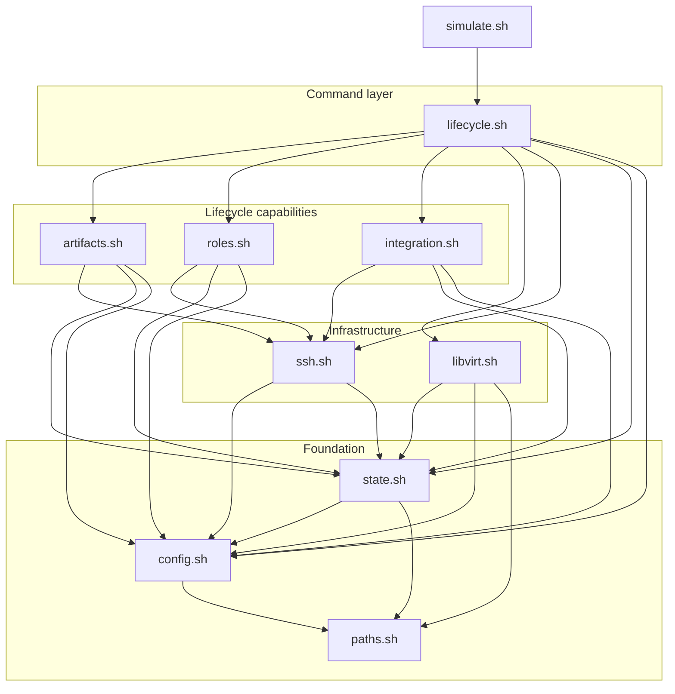
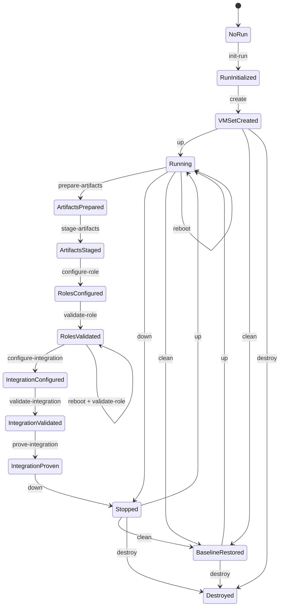
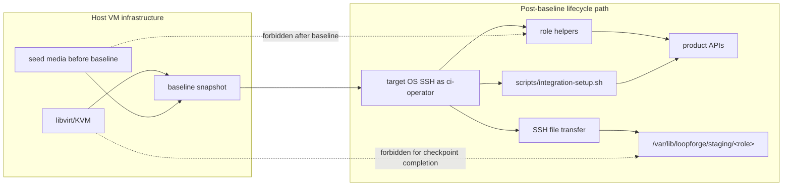

# VM Simulation Harness Design

This document records the internal design and implementation contracts for the
VM simulation harness. `simulation/vm/README.md` owns the public VM simulation
command contract; this file owns the harness module structure and internal
implementation boundaries.

The design intent is to keep VM simulation near target deployment after the
clean baseline snapshot while avoiding premature abstraction. VM simulation may
share backend-neutral mechanics with Docker simulation, but VM lifecycle,
transport, libvirt/KVM resources, snapshots, seed media, guest SSH readiness,
and VM-set cleanup remain VM-local until implementation proves a smaller
durable shared boundary.

Per-command internal sequence diagrams are documented in
`simulation/vm/sequences.md`.

The accepted detailed decision for splitting the M5 `libvirt.sh` monolith is
documented in `simulation/vm/libvirt-refactor.md`. Read that companion before
changing libvirt operations, VM-set ownership, baked images, seed media,
snapshots, or guest baseline and LDAP verification.

## Design Direction

VM simulation intentionally does not mirror the Docker harness structure when
Docker structure reflects Compose, container, bind-mount, loopback-port, or
Docker transfer assumptions.

The VM harness has three implementation layers:

1. VM infrastructure: libvirt/KVM domains, networks, storage, seed media,
   snapshots, VM-set ownership, start/stop, cleanup, and destruction.
2. Target control plane: target OS SSH as the operator account, known-hosts
   handling, readiness checks, bounded remote execution, file transfer, and
   delegated privilege when needed for narrow OS work.
3. Loopforge lifecycle: artifact preparation and staging, role helper
   execution, integration setup, validation, proof, evidence, and markers.

After the clean baseline snapshot is captured, lifecycle checkpoint work must
use target-like interfaces and helper-visible paths. Host-side VM
infrastructure mechanisms remain available for VM lifecycle management, but
they must not complete Loopforge role or integration checkpoints.

## Host Storage Ownership

The host operator owns generated control metadata, including pool and volume
XML, ownership markers, cache fingerprints, locks, logs, and evidence.
Published baked images and per-machine qcow2 disks are libvirt-managed storage
volumes. Their runtime POSIX owner is host-specific and is not part of the
harness contract. Domains attach the libvirt-reported mutable volume path as a
file-backed disk so libvirt applies the host security driver's runtime label.
Read-only base volume validity does not depend on its post-shutdown owner.

The directory-pool backend on the validation host ignored requested volume
owner and group values and created mutable overlays as `root:root 0600`.
Attaching those overlays with a `type='volume'` domain disk did not trigger DAC
relabeling, so QEMU could not open them. The same unchanged volume started when
attached by its libvirt-reported path as `type='file'`; libvirt then applied
the KVM DAC label. Volume creation and inspection therefore remain mediated by
libvirt storage APIs, while domain attachment uses that reported file path.

After a qcow2 file is adopted, the harness uses libvirt storage APIs for
format, capacity, path, backing-store, content-download, and deletion
operations. It does not use direct `qemu-img`, `sha256sum`, `chmod`, or `chown`
against adopted volume paths. This keeps validation and later M5 destruction
independent of libvirt DAC ownership restoration, SELinux, and AppArmor
details.

## Initial Module Layout

The VM harness should start with a folded module layout. The folded structure
keeps important ownership boundaries visible without scattering early
implementation across many tiny files.

```text
simulation/vm/
  simulate.sh
  lib/
    config.sh
    paths.sh
    state.sh
    libvirt.sh
    ssh.sh
    lifecycle.sh
    artifacts.sh
    roles.sh
    integration.sh
```

`simulate.sh` is the public entrypoint. It should stay thin: parse CLI
arguments, load shared and VM-local modules, install common traps, and dispatch
to command functions. It should not contain lifecycle implementation bodies.

`config.sh` owns VM harness configuration, defaults, env selection, VM-set and
run identity resolution, and rendered endpoint values that are not large
enough to justify a separate inventory module.

`paths.sh` owns generated path contracts for run-scoped output and reusable
VM-set state:

```text
generated/simulation/vm/<run-id>/
generated/simulation/vm/vm-sets/<vm-set-id>/
```

Other modules should ask `paths.sh` for generated locations instead of
reassembling path contracts.

`state.sh` owns run markers, VM-set markers, ownership metadata, consistency
checks, checkpoint marker verification, and the first read-only audit checks.

`libvirt.sh` owns low-level VM infrastructure operations: domains, networks,
storage, seed media, guest baseline preparation, baseline snapshot capture,
rollback, graceful shutdown, and VM-set destruction primitives. It must not run
role helpers or complete Loopforge lifecycle checkpoints through host-side
guest mutation.

`ssh.sh` owns target OS control-plane access: SSH as the target-local operator
account, known-hosts capture and verification, remote command execution,
remote readiness checks, and SSH file transfer. Artifact transfer to service
VMs should use this module rather than a separate early transport abstraction.

`lifecycle.sh` owns command orchestration for VM lifecycle commands such as
`run`, `create`, `up`, `status`, `ssh`, `reboot`, `down`, `clean`, `destroy`,
and `audit-state`. It coordinates other modules but should keep low-level
libvirt, SSH, role helper, and integration details delegated.

`artifacts.sh` owns VM artifact flow: running role helper
`prepare-artifacts` commands in the bundle factory VM, retaining host-side
export review copies, transferring archives to target VMs through SSH, and
verifying target-side manifests and checksums under
`/var/lib/loopforge/staging/<role>` before service mutation.

`roles.sh` owns role-local helper phases over target OS SSH, including
`configure-role` and `validate-role`. It should not know libvirt lifecycle
details.

`integration.sh` owns calls to `scripts/integration-setup.sh` for
`configure-integration`, `validate-integration`, and `prove-integration`. It
must enforce matching validation markers before active proof and must fail or
report blocked rather than creating synthetic success markers.

## Initial Folded Module Relationships

The initial VM harness module layout was designed as a layered shell API.
Command-shaped entrypoints belong in `lifecycle.sh`; other modules expose
capability-shaped APIs. Lower layers must not call higher layers. The accepted
refactor below replaces the folded relationships where implementation pressure
proved a smaller boundary.



Forbidden dependency directions include:

- `libvirt.sh` to `artifacts.sh`, `roles.sh`, or `integration.sh`
- `ssh.sh` to `lifecycle.sh`
- `state.sh` to `lifecycle.sh`
- `config.sh` to `lifecycle.sh`

## Lifecycle State Model

The harness should fail clearly when a command is run before its prerequisite
state exists. Cleanup and destruction commands are explicit lifecycle actions,
not implicit recovery inside normal workflow commands.



`reboot` is a VM lifecycle operation, not readiness proof by itself. It may
run only against running VM targets. Any role or integration readiness claim
that matters after reboot must be re-established by rerunning the matching
validation or proof command. The `reboot + validate-role` edge is diagram
layout shorthand for the M7 sequence `reboot --all` followed by a separate
`validate-role`; it is not a combined command. M8 or final acceptance may
require integration validation and proof after reboot.

`prove-integration` must require a matching `validate-integration` marker for
the same run. `run` is a composite over normal workflow commands only; it must
not call `down`, `clean`, `destroy`, or `audit-state`.

## Post-Baseline Boundary Diagram

After baseline capture, lifecycle checkpoint work must pass through target-like
interfaces. Host-side VM infrastructure remains valid for VM lifecycle
management, but it must not complete role or integration checkpoints.



## Initial Folded Module API

Until the accepted refactor is implemented, public module functions use a
`vm_` prefix. Module-private helpers should use a `__vm_` prefix or remain
local to the file. `simulate.sh` should call command functions, not low-level
implementation helpers.

| Module | Public API shape | Owns |
| --- | --- | --- |
| `simulate.sh` | command dispatch only | CLI parsing, module loading, and command routing |
| `lifecycle.sh` | `vm_cmd_*` | command choreography and composite workflow |
| `config.sh` | `vm_config_*` | env files, defaults, selected identities, and rendered endpoint values |
| `paths.sh` | `vm_path_*` | generated run and VM-set path contracts |
| `state.sh` | `vm_state_*` | run markers, VM-set markers, ownership, checkpoint markers, and audit checks |
| `libvirt.sh` | `vm_libvirt_*` | VM infrastructure primitives, guest baseline preparation, seed media, snapshots, and VM-set lifecycle |
| `ssh.sh` | `vm_ssh_*` | target OS SSH, known-hosts, readiness, remote command execution, and transfer |
| `artifacts.sh` | `vm_artifacts_*` | bundle-factory preparation and target-side artifact staging |
| `roles.sh` | `vm_roles_*` | role-local `configure-role` and `validate-role` helper phases |
| `integration.sh` | `vm_integration_*` | integration setup, validation, proof, and validation marker enforcement |

## Folded Boundaries

The initial layout intentionally folds several conceptual modules into broader
files:

| Conceptual module | Initial location | Split trigger |
| --- | --- | --- |
| `vm_set.sh` | `state.sh` | VM-set ownership and consistency checks become large enough to obscure run marker handling. |
| `inventory.sh` | `config.sh` or `paths.sh` | Endpoint rendering and identity checks become reused across many commands. |
| `seed_media.sh` | `libvirt.sh` | Seed rendering, cloud-init, or LDIF handling becomes substantial. |
| `snapshots.sh` | `libvirt.sh` | Baseline capture and rollback require enough checks to obscure libvirt primitives. |
| `ldap.sh` | `lifecycle.sh` during `create` | LDAP seed verification and bind/search proof become a substantial verifier. |
| `nfs.sh` | `lifecycle.sh` or `integration.sh` | NFS setup and shared-storage proof need independent lifecycle handling. |
| `transfer.sh` | `ssh.sh` | Non-SSH VM transfer mechanisms become necessary and approved. |
| `status.sh` | `lifecycle.sh` | Status grows into a substantial read-only reporting surface. |
| `clean.sh` | `lifecycle.sh` | Cleanup and destruction orchestration becomes too large for lifecycle command flow. |
| `audit.sh` | `state.sh` or `lifecycle.sh` | Audit becomes a first-class report with many independent checks. |

Splits should be driven by implementation pressure, not by matching a
preselected file list.

## Accepted Libvirt Refactor

The M4 and M5 implementation activated the `vm_set.sh`, `seed_media.sh`,
`snapshots.sh`, and LDAP verifier split triggers above. Baked-image and
libvirt-managed storage work also established two substantial boundaries that
the initial table did not anticipate.

The accepted target keeps `libvirt.sh` as the logical libvirt entrypoint and
splits implementation into capability-shaped modules:

| Target module | Owns |
| --- | --- |
| `libvirt.sh` | Constants, explicit implementation loading, and the logical libvirt API boundary |
| `libvirt-core.sh` | Preflight, resource identity, live queries, domain runtime control, addresses, and status |
| `libvirt-storage.sh` | Pools, volumes, disk metadata and identity, mediated checksums, and storage removal primitives |
| `libvirt-domain.sh` | Network and domain definitions, machine definition, SSH-key preparation, and seed media |
| `libvirt-image.sh` | Package policy, image fingerprinting, bake workflow, publication locking, and cache validation |
| `baseline.sh` | Guest package and LDAP proof plus baseline-readiness markers over target SSH |
| `snapshots.sh` | Snapshot status, records, capture, verification, and restore coordination |
| `vm-set.sh` | VM-set marker identity, live ownership validation, create composition, teardown, and audit |

The target dependency direction is
`lifecycle -> vm-set/baseline/snapshots -> libvirt/ssh/state -> config/paths`.
`state.sh` must not query live libvirt resources, and the `libvirt-*.sh`
implementation files must not call target SSH or state functions. Detailed
rationale, current anatomy, API policy, migration slices, and verification are
owned by `simulation/vm/libvirt-refactor.md`.

## Shared Helper Boundary

Backend-neutral mechanics may live under `simulation/lib/`:

- role parsing and role iteration
- env loading and required variable checks
- runtime input custody helpers
- bounded log setup
- evidence record helpers
- marker read/write/verify helpers
- redaction helpers
- artifact manifest and checksum helpers
- shell quoting and compact command summaries

VM-specific behavior must remain under `simulation/vm/`:

- libvirt/KVM domain, network, storage, and snapshot operations
- VM-set ownership and generated VM-set metadata
- seed media, cloud-init base provisioning, and role OS dependency baseline
  fulfillment
- guest boot, reboot, shutdown, and SSH readiness
- target OS SSH command execution and file transfer
- NFS-backed shared storage realization
- VM cleanup, rollback, and destruction behavior

Do not introduce a Docker/VM backend abstraction until the VM harness has
enough implementation to prove a stable interface. Prefer small shared support
helpers first.

## Implementation Milestones

VM simulation should be implemented milestone by milestone. Each milestone
should leave the harness in a reviewable state with compact terminal output,
bounded logs, generated evidence where applicable, and no hidden cleanup or
destruction side effects.

Milestone completion requires fail-closed runtime proof as defined in
`simulation/vm/verification.md`. Marker files, terminal summaries, and
evidence records summarize checks; they do not satisfy a milestone when
bounded logs contain contradictory failure evidence.

Composite `run` should be implemented only after the individual lifecycle
commands are credible. Early milestones should prefer explicit command
execution so failures expose the exact boundary that is not ready.

| Milestone | Commands | Main modules | Acceptance shape |
| --- | --- | --- | --- |
| M1 Harness skeleton and read-only run state | `preflight`, `init-run`, partial `status`, partial `audit-state` | `simulate.sh`, `config.sh`, `paths.sh`, `state.sh`, shared `simulation/lib/*` | CLI dispatch works, env inputs are copied to private runtime inputs, the run marker exists, compact summaries print, and no VM or libvirt mutation occurs. |
| M2 VM-set ownership and libvirt preflight | `preflight`, `audit-state` | `state.sh`, `libvirt.sh`, `lifecycle.sh` | Local tooling and libvirt access are checked read-only, the VM-set metadata contract is defined, inconsistent selected resources fail clearly, and no repair occurs. |
| M3 Create/up/down with SSH-ready base VMs | `create`, `up`, `down`, `status`, `ssh` | `libvirt.sh`, `ssh.sh`, `lifecycle.sh`, `config.sh` | The VM set can be created, started, reached over target OS SSH as `ci-operator`, inspected, and shut down; missing domains, host keys, leases, or SSH readiness fail closed. |
| M4 Baseline prerequisites: role OS dependencies and LDAP proof | `create`, `up`, `status`, `audit-state` | `libvirt.sh`, `ssh.sh`, `lifecycle.sh`, folded LDAP logic | VM provisioning proves role OS dependency installation, command availability, real LDAP service readiness, seed entries, local bind/search, and Gerrit/Jenkins controller LDAP reachability before baseline readiness is written. |
| M5 Baseline snapshot, clean rollback, and destroy | `create`, `clean`, `destroy`, `audit-state` | `libvirt.sh`, `state.sh`, `lifecycle.sh` | The baseline snapshot is captured after M4 prerequisites and before Loopforge mutation, `clean` rolls back only the selected owned VM set, and `destroy` deletes only validated simulation-owned resources. |
| M6 Artifact prepare/stage over target-like paths | `prepare-artifacts`, `stage-artifacts` | `artifacts.sh`, `ssh.sh`, `paths.sh` | The bundle factory runs helper artifact preparation, host review copies are retained, service VMs receive artifacts through SSH, and target-side manifests and checksums verify under `/var/lib/loopforge/staging/<role>`. |
| M7 Role configure/validate phases | `configure-role`, `validate-role`, `reboot` | `roles.sh`, `ssh.sh`, `lifecycle.sh` | Role helpers run over target OS SSH, role evidence is captured, real service/runtime readiness is proven, and any readiness claim after reboot is re-established by validation. |
| M8 Integration validate/prove and composite run | `configure-integration`, `validate-integration`, `prove-integration`, `run` | `integration.sh`, `lifecycle.sh`, `ssh.sh` | Shared integration setup runs through `scripts/integration-setup.sh`; validation/proof require real cross-role SSH, Jenkins node readiness, trigger/build behavior, and Gerrit `Verified` proof. |

M1 is the first implementation unit. It creates the VM CLI skeleton, initial
folded modules, read-only command dispatch, runtime input custody, generated
run paths, and run marker handling. It must not create, modify, or delete
libvirt resources.

M3 and M4 are the highest-risk early milestones. M3 proves that the VM control
plane is real and stable. M4 proves that role OS dependency readiness and LDAP
readiness are not modeled.

## M3 Provisioning Decision

M3 uses Cloud Image Clone provisioning. The harness consumes an
operator-provided local Ubuntu Noble cloud image, such as
`noble-server-cloudimg-amd64.img`, creates per-VM qcow2 disks, renders
cloud-init seed media for the simulation operator account, defines libvirt
domains, and proves target OS SSH readiness.

This is the selected first implementation because it is repeatable, faster
than ISO or network installation, and less operator-specific than attaching to
precreated base VMs. Precreated base VMs remain too dependent on external
golden-image custody for the reusable VM-set ownership model, and ISO/net
install remains too slow and broad for the M3 control-plane milestone.

The Ubuntu cloud image is VM host infrastructure input, not a Loopforge
application artifact. Cloud-init is allowed for base OS bootstrap and role OS
dependency fulfillment before the clean baseline boundary; later role and
integration checkpoints must not use post-baseline cloud-init. Role helpers
validate OS dependency expectations after the baseline snapshot; they do not
install Ubuntu/OS dependencies.

## Post-Baseline Rules

After `create` captures the clean baseline snapshot, lifecycle checkpoints
must use target-like interfaces and paths:

- target OS SSH as the operator account
- SSH file transfer
- role helpers
- `scripts/integration-setup.sh`
- product APIs
- runtime accounts
- target-side checksum verification
- `/var/lib/loopforge/staging/<role>`

The VM harness must not use the following mechanisms to complete post-baseline
Loopforge lifecycle checkpoints:

- libvirt console access
- direct guest disk or image edits
- post-baseline cloud-init
- host-side injection into guest helper or product paths
- generated target sideband staging
- modeled success without runtime evidence
- synthetic role or integration success markers

Host-side libvirt/KVM operations remain valid for VM infrastructure commands
such as `up`, `down`, `clean`, and `destroy`, subject to ownership checks and
operator approval requirements.

## Review Checks

When changing VM harness implementation, reviewers should check that:

- public command behavior remains documented in `simulation/vm/README.md`
- internal module boundaries remain consistent with this file
- generated VM-set state and run-scoped output stay separate
- mutating VM commands validate VM-set ownership before acting
- post-baseline role and integration work uses target OS SSH and
  helper-visible paths
- LDAP readiness is proven with simulation-owned bind/search evidence
- application artifacts are prepared only in the bundle factory and verified
  target-side before mutation
- public internet fallback remains simulation-only and limited to Ubuntu/OS
  dependency installation during VM baseline provisioning
- root is not introduced as a Loopforge account, helper execution identity,
  runtime identity, or direct login identity
- evidence, logs, terminal summaries, and generated records remain bounded and
  redacted
