# VM Simulation Command Sequences

This document records internal command sequence diagrams for the VM simulation
harness. `simulation/vm/README.md` owns the public command contract, and
`simulation/vm/design.md` owns the module boundary model. These diagrams
validate how the public commands should flow through the folded VM modules.

The diagrams use capability-shaped APIs below `lifecycle.sh`. Command-shaped
APIs should stay in `lifecycle.sh`.

## preflight

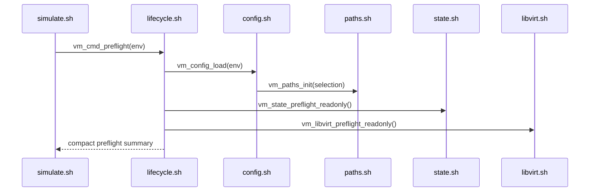

## init-run

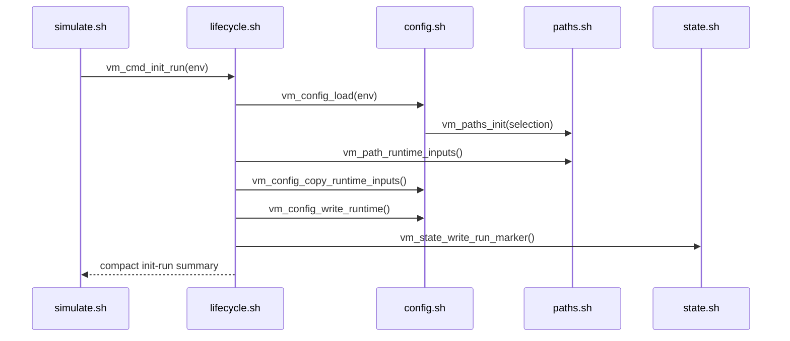

## create

```mermaid
sequenceDiagram
  participant CLI as simulate.sh
  participant LC as lifecycle.sh
  participant CFG as config.sh
  participant SET as vm-set.sh
  participant BASE as baseline.sh
  participant SNAP as snapshots.sh
  participant LV as libvirt.sh
  participant SSH as ssh.sh

  CLI->>LC: vm_cmd_create(env)
  LC->>CFG: vm_config_load_runtime()
  LC->>SET: vm_set_prepare()
  LC->>SNAP: vm_snapshots_status()
  Note over LC,SNAP: reuse only matching ready baseline state; fail on stale state
  LC->>SET: vm_set_create()
  LC->>LV: vm_libvirt_start_set()
  LC->>SSH: vm_ssh_prepare_all()
  LC->>BASE: vm_baseline_verify_prereqs()
  Note over LC,BASE: verify role OS dependency baselines and LDAP proof
  LC->>LV: vm_libvirt_shutdown_set()
  LC->>SNAP: vm_snapshots_capture()
  LC-->>CLI: compact create summary
```

## up

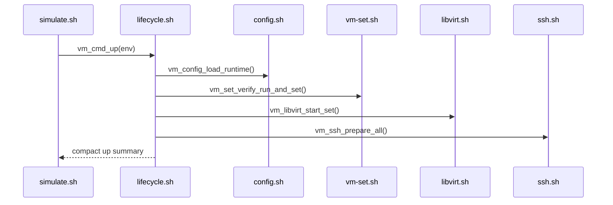

## status

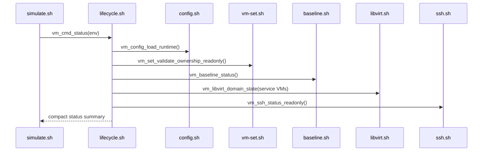

## ssh

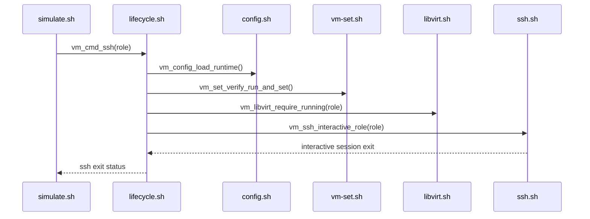

## prepare-artifacts

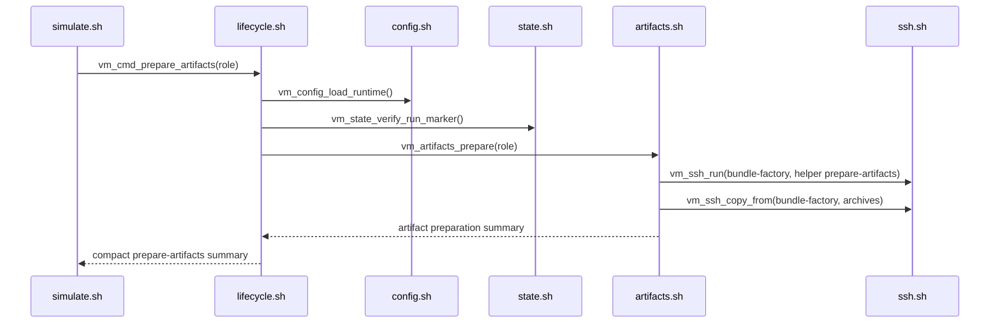

## stage-artifacts

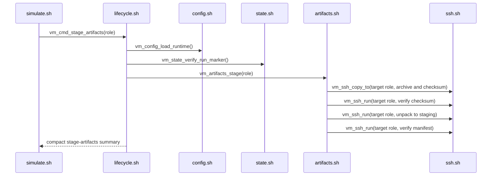

## configure-role

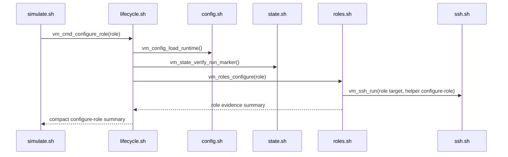

## validate-role

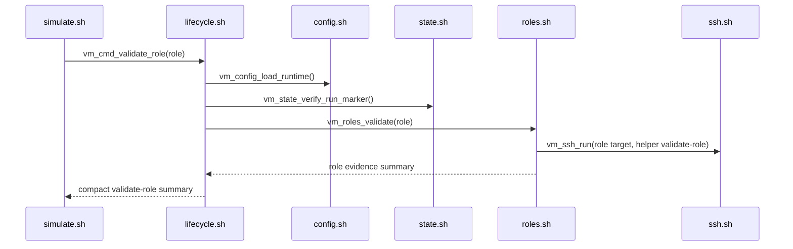

## configure-integration

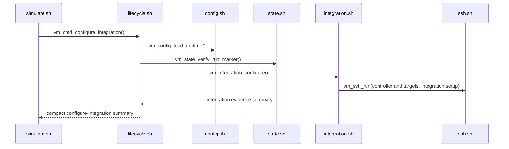

## validate-integration

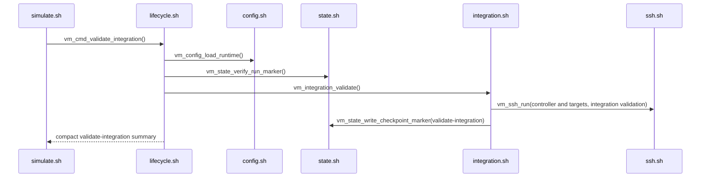

## prove-integration

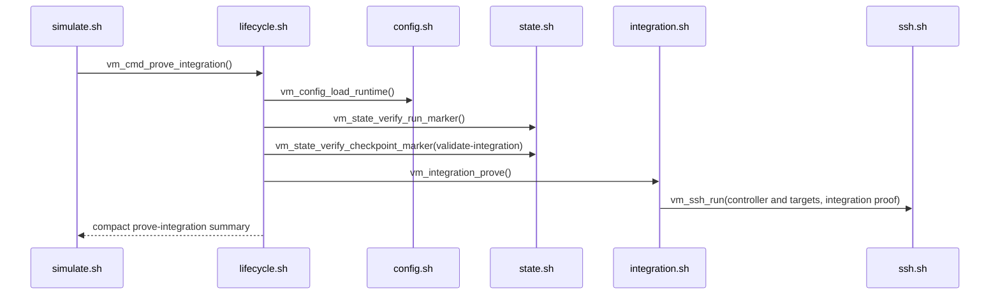

## reboot

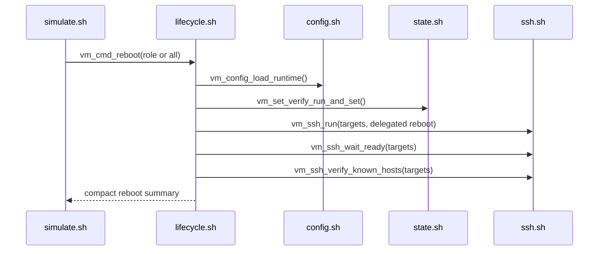

## audit-state

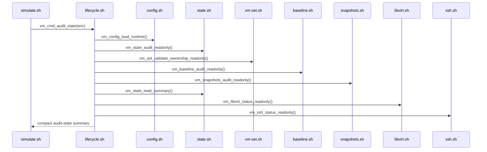

## down

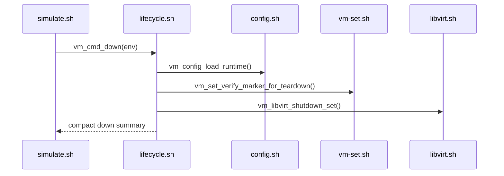

## clean

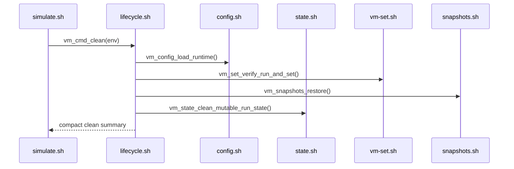

## destroy

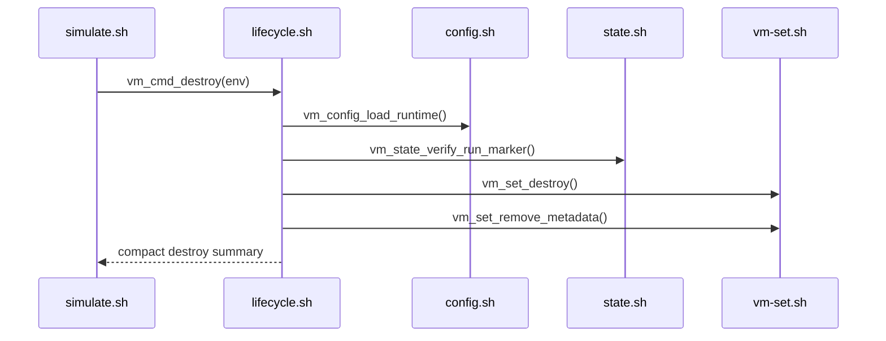

## run

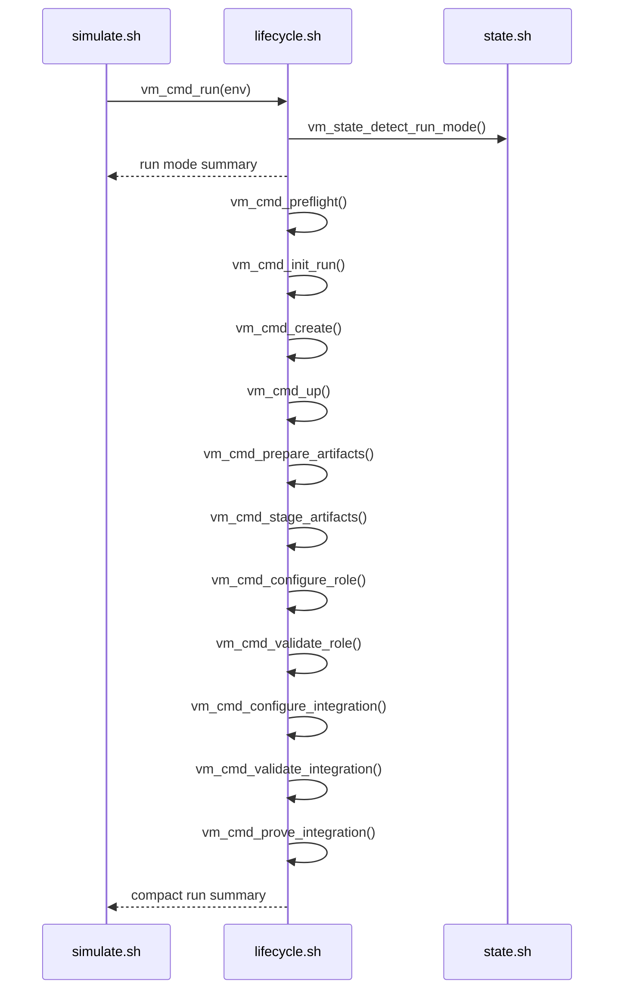
